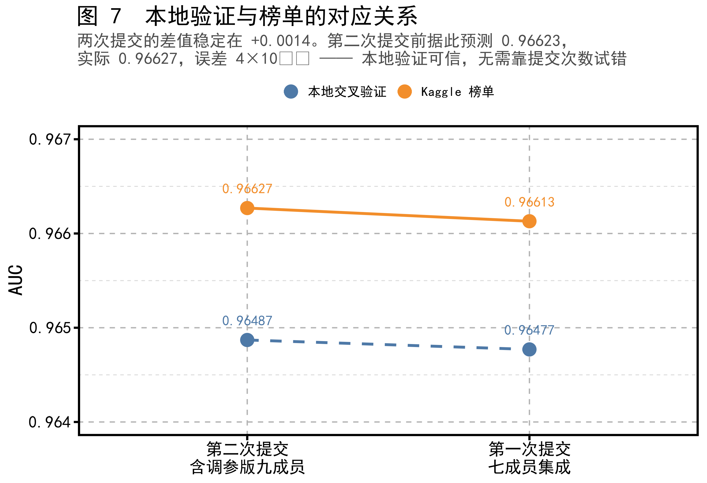
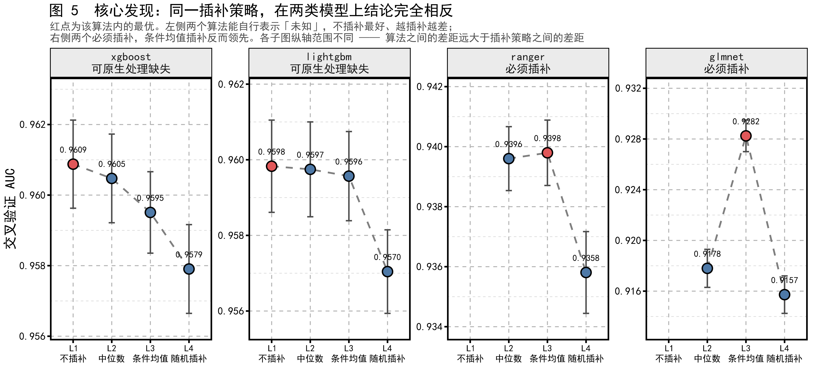

# 智能手机成瘾预测 · 项目总览

> 本文面向组内成员，用于在半小时内建立对本项目的完整认识。
> 阅读本文不需要预先了解机器学习细节；涉及专业概念处均附有解释。
>
> 更详细的技术推导见 [项目说明.md](项目说明.md)，
> 全部实验数字见 [output/results.md](../output/results.md)，
> 当前进度与分工见 [进度.md](进度.md) 与 [小组分工.md](小组分工.md)。

---

## 一、任务复述

### 1.1 要做什么

给定一份用户手机使用行为的记录，预测每位用户是否属于"手机成瘾"。

这是一个二分类问题，但提交内容**不是 0 或 1 的判断，而是一个概率值**。
评价指标为 **ROC-AUC**（ROC 曲线下面积）。

### 1.2 为何采用 AUC 而非准确率

数据中 70.94% 的样本被标记为成瘾。若不加分析地将全部样本预测为"成瘾"，
准确率即可达到 70.94%，但这样的模型没有任何实际价值。

AUC 衡量的是**排序能力**：任取一名成瘾者与一名非成瘾者，
模型给前者打分更高的概率即为 AUC。当模型对所有样本给出相同预测时，
AUC 恰为 0.5，等同于随机猜测。因此 AUC 不会被类别不平衡所掩饰。

这也解释了官方提供的示例提交文件中所有行均填写 `0.7094243450313797`
的原因——该值正是训练集的成瘾比例，代表"不掌握任何信息"的基线。

### 1.3 数据规模

| 项目 | 数值 |
|---|---|
| 训练集 | 691,369 行 |
| 测试集 | 296,302 行 |
| 特征数 | 12 |
| 成瘾比例 | 70.94% |
| **至少缺失一个特征的行** | **61.06%** |

十二个特征包括每日屏幕时间、社交媒体时间、游戏时间、工作学习时间、
睡眠时间、每日通知数、应用打开次数、周末屏幕时间、年龄、性别、
压力水平、学业工作影响。

### 1.4 本题的实质

两项观察共同决定了本项目的方向：

其一，**在数据完整的样本上，标签几乎是确定的**。将"屏幕时间 + 社交时间"
分箱后，成瘾比例从 18% 单调上升至 100%，全程没有反复（图 2）。

其二，**61% 的样本存在缺失**，且经检验缺失是完全随机产生的，
缺失位置本身不携带任何信息。

因此，本题的难点不在于建立复杂模型，而在于**如何在信息不完整的条件下
恢复判断依据**。这一认识贯穿了整个项目。


---

## 二、工作流程总览

项目按以下顺序推进，每一步的产出都是下一步的输入：

```
原始数据
   │
   ├─→ 探索性分析 ────────→ 9 项数据发现
   │
   ├─→ 特征工程 ──────────→ 31 个候选特征
   │
   ├─→ 折叠划分（冻结） ──→ 全组共享的评价基准
   │
   ├─→ 缺失值处理（4 种方案）
   │        ×
   │   模型拟合（4 种算法）  ──→ 14 组对照实验
   │
   ├─→ 变量筛选（消融实验）→ 特征取舍依据
   │
   ├─→ 超参数搜索 ────────→ 模型配置优化
   │
   ├─→ 集成模型 ──────────→ 最终预测
   │
   └─→ 提交与验证 ────────→ Kaggle 榜单 0.96627
```

其中"折叠划分冻结"是一项关键的工程约定，详见第五节。

---

## 三、特征工程

### 3.1 原始特征的结构性关系

探索性分析发现了一条在数据中**无条件成立**的关系：

```
每日屏幕时间 ≥ 社交媒体时间 + 游戏时间
```

在三列均无缺失的 451,246 行中，该关系成立 451,246 次，成立比例 100.00%。
这并非统计上的相关性，而是变量定义决定的结构性约束——
屏幕时间本身即由社交、游戏及其他用途构成。


此外，周末屏幕时间与每日屏幕时间的相关系数达 0.80，比值稳定在 1.33 左右，
二者互为代理变量。

### 3.2 派生特征的构造

基于上述结构关系，构造了六个派生特征：

| 派生特征 | 定义 | 设计意图 |
|---|---|---|
| 其他屏幕时间 | 屏幕时间 − 社交 − 游戏 | 提取第三类用途，保证非负 |
| 周末比值 | 周末屏幕 ÷ 每日屏幕 | 刻画作息差异 |
| 社交占比 | 社交时间 ÷ 屏幕时间 | 相对强度而非绝对时长 |
| 游戏占比 | 游戏时间 ÷ 屏幕时间 | 同上 |
| 空闲时间占比 | 屏幕时间 ÷ (24 − 睡眠 − 工作) | 可支配时间的使用强度 |
| 屏幕加社交 | 屏幕时间 + 社交时间 | 近似充分统计量 |

### 3.3 特征计算的时序要求

派生特征全部是比值或差值，**只要任一分量缺失，结果即为缺失**。
因此在流程上必须遵守一条次序：**先填补缺失值，再计算派生特征**。
若次序颠倒，派生特征将大面积失效。

这一约束已固化在代码框架中（`R/06_framework.R`），
各条实验线无法绕过。

### 3.4 派生特征的实际效果

需要如实说明：**上述六个派生特征在实验中未产生正面作用**。

将其全部移除后，模型表现没有下降；在部分实验线上甚至略有上升
（详见第四节）。原因在于梯度提升树能够自行学习这些线性组合，
无需人工预先给出。

此项结论虽不符合预期，但具有明确的实践价值：
**在树模型上，构造线性组合类的派生特征收益有限。**

---

## 四、变量筛选

### 4.1 筛选方法

本项目采用**消融实验**作为变量取舍的依据：逐一移除某个特征或某组特征，
在完全相同的评价条件下重新训练模型，观察 AUC 的变化量。
下降越多，说明该特征越不可替代。

同时计算了**置换重要性**作为交叉验证：在验证集上将某一列的取值随机打乱，
重新预测并观察 AUC 下降幅度。该指标衡量的是"已训练好的模型对该列的依赖程度"。

### 4.2 消融结果


| 移除对象 | AUC 变化 | 结论 |
|---|---|---|
| 每日通知数 | **−0.00825** | 不可移除 |
| 每日应用打开次数 | **−0.00705** | 不可移除 |
| 12 个缺失指示变量 | +0.00003 | 无贡献 |
| 性别、压力水平、学业工作影响 | +0.00009 | 无贡献 |
| 年龄 | +0.00001 | 无贡献 |
| 6 个派生特征 | +0.00012 | 无贡献 |

### 4.3 置换重要性


置换重要性给出的排序与消融结果一致：

| 特征 | 置换重要性 |
|---|---|
| 每日屏幕时间 | 0.1021 |
| 周末屏幕时间 | 0.0815 |
| 社交媒体时间 | 0.0342 |
| 每日通知数 | 0.0155 |
| 每日应用打开次数 | 0.0134 |
| 工作学习时间 | 0.0112 |
| 其余全部特征 | < 0.008 |

值得注意的是，**周末屏幕时间的重要性位居第二**。
该变量与每日屏幕时间高度相关，看似冗余，
但当每日屏幕时间缺失时（占 13.86%），它是最可靠的替代来源。
这说明**冗余变量在存在缺失的场景下具有实质价值**。

### 4.4 三种重要性口径的分歧

模型内建的"增益重要性"给出了一个与上述两种口径不同的结果：
派生特征"屏幕加社交"的增益占比高达 9.41%，排名第三，
但其置换重要性仅为 0.0010，几乎可以忽略。

这一分歧有明确解释。增益重要性统计的是"该特征在树的分裂中被使用的程度"，
而取值连续的特征可被反复切分，容易累积较高的增益。
置换重要性衡量的则是"移除该特征后模型是否仍能正常工作"。
"屏幕加社交"被频繁使用，但一旦打乱，模型立即改用其两个分量替代，
因而并非不可或缺。

**结论：评估特征价值时应以置换重要性与消融实验为准，
增益重要性仅可作为参考。**

### 4.5 是否应当移除无贡献特征

实验表明，移除已确认无贡献的特征（缺失指示、类别变量、年龄、派生特征）
对模型表现没有可测量的改善。因此**最终模型保留全部特征**，不做筛选。

保留的另一考虑是：这些特征的"无效"本身是本项目的研究结论之一，
删除后将失去证据。

---

## 五、模型拟合

### 5.1 评价基准的统一

在开展任何建模工作之前，项目首先固定了一套**交叉验证折叠划分**，
将 691,369 个训练样本按标签分层随机划分为五份，并将结果保存为文件
（`output/folds.rds`），生成后不再变动。

此举的意义在于：**所有实验的分数因此可以直接比较**。
若各人自行划分数据，分数差异中将混入划分方式的影响，
方法之间的比较将失去意义。

实测各折的成瘾比例完全一致，极差为 0.00000。

### 5.2 防止信息泄漏的处理次序

缺失值填补本身需要从数据中学习规律（例如"屏幕时间缺失时如何估计"）。
若在全部训练数据上学习这一规律，再用于评价，
则验证部分的信息会通过填补参数间接进入训练过程，导致分数虚高。

因此框架强制规定：**填补模型只能在每一折的训练部分上拟合**，
再用于变换训练部分与验证部分。

这一约定在项目后期被证明至关重要。虚高的幅度会随填补方法的复杂程度递增，
若不加控制，复杂方法将获得系统性的不当优势，
第九节所述的核心结论也就无从成立。

### 5.3 四种缺失值处理方案

| 方案 | 处理方式 | 特点 |
|---|---|---|
| L1 | 不填补，保留缺失 | 仅部分算法支持 |
| L2 | 填入该列的中位数 | 最常见的做法 |
| L3 | 用其他变量回归估计 | 利用变量间相关性 |
| L4 | 从相似样本中随机抽取真实取值 | 保留原始分布形态 |

四者构成一个阶梯，区别在于**对填补值的"确信程度"依次递增**。

### 5.4 四种算法

| 算法 | 类型 | 能否处理缺失 |
|---|---|---|
| xgboost | 梯度提升树 | 可以 |
| lightgbm | 梯度提升树 | 可以 |
| ranger | 随机森林 | 不可以 |
| glmnet | 正则化逻辑回归 | 不可以 |

四种缺失处理方案与四种算法交叉，构成 14 组对照实验
（ranger 与 glmnet 无法使用 L1，故为 14 组而非 16 组）。

### 5.5 计算资源的分配

完整数据为 69 万行，若全部实验均在全量上进行，计算时间无法接受。
项目因此采用两级设计：

- **对照实验**在分层抽取的 20 万行子样本上进行，用于方法比较；
- **最终候选模型**在全量 69 万行上重新训练。

事后验证表明，两种规模下模型的排序完全一致（Spearman 相关系数 1.000），
说明子样本上的结论可以外推至全量。

---

## 六、超参数搜索

### 6.1 训练轮数

梯度提升树需要指定训练轮数。项目初期采用固定值 600 轮，
这一数值缺乏依据。改为**早停机制**后——即在训练过程中持续监控表现，
当不再改善时自动停止——模型自动选择的轮数约为 1158 轮，
接近原设定的两倍。

| 设置 | 交叉验证 AUC |
|---|---|
| 固定 600 轮 | 0.95910 |
| 早停自动确定 | **0.96088** |

**该项改动带来 +0.00178 的提升**，超过后文所述四种缺失处理方案
之间全部差距（0.00297）的一半。原有模型此前一直处于欠拟合状态。

### 6.2 参数网格搜索

在早停基础上，对学习率与树深度进行了两阶段搜索，共评估 18 组配置。

| 配置 | AUC |
|---|---|
| 默认（学习率 0.05，深度 6） | 0.96078 |
| 最优（学习率 0.05，**深度 4**） | **0.96145** |

搜索结果显示**较浅的树表现更好**。这与第一节所述的数据特性一致：
标签近似为少数几个变量的单调函数，不需要很深的树来刻画复杂交互。

### 6.3 结论的稳健性检验

一个合理的质疑是：四种缺失处理方案的优劣排序，
是否只在特定超参数下成立？

为回答此问题，项目使用搜索得到的最优参数重新运行了四条实验线。
结果显示排序保持不变，**结论不依赖于超参数的选择**。

### 6.4 一项需要注意的技术细节

在全量数据上应用最优参数时，出现了一个与预期相反的结果：
深度为 4 的配置表现反而低于深度为 6。

经查，原因是**训练轮数触及了预设的上限**。深度较浅的模型需要更多轮数，
在 20 万行上需要约 2748 轮（未超上限），
但在 69 万行上需要约 4405 轮，超出了当时设定的 3000 轮上限，
模型在仍能改善时被强制中止。

将上限提高后，最优参数配置恢复领先。
此案例说明：**训练轮数的上限本身也是一个会静默生效的设置**，
需要在结果中留意其是否成为约束。

---

## 七、集成模型

### 7.1 基本思路

集成是指将多个模型的预测结果合并，以期获得优于任何单一模型的表现。
其效果取决于成员之间的**差异性**——若各模型在相同样本上犯相同错误，
合并不会带来改善。

项目比较了三种合并方式：

| 方式 | 原理 |
|---|---|
| 二层逻辑回归 | 以各模型预测为输入，训练一个新模型学习权重 |
| 排序平均 | 将各模型预测转为排名后取平均 |
| 爬山法 | 逐步选入模型，每次选择使整体表现提升最多的一个 |

### 7.2 成员选择

初期按 AUC 高低选取前五名，结果全部为梯度提升树，
彼此之间的排序相关系数高达 0.991–0.996，实质上是同一模型的多个副本。

调整为**按算法类别各取其最优者**后，随机森林与逻辑回归得以进入，
成员间最低相关系数降至 0.939。

### 7.3 结果

| 合并方式 | AUC |
|---|---|
| 二层逻辑回归 | 0.96458 |
| 排序平均 | 0.96263 |
| **爬山法** | **0.96487** |
| 最优单一模型 | 0.96465 |

**集成相对最优单一模型仅提升 0.00022。**

需要说明的是，排序平均的表现反而低于最优单一模型，
原因是该方法对所有成员一视同仁，
而逻辑回归（0.928）与随机森林（0.941）的水平明显低于梯度提升树（0.965）。
爬山法能够自动压低这两者的权重，因此是三种方式中唯一带来改善的。

### 7.4 对集成效果的评价

本项目中集成的收益有限，原因是客观存在的：
候选模型中存在一个明显占优者，且多数成员高度同质。

**在此类情形下，集成本身价值不大。**
项目未通过挑选成员或调整口径来美化这一结果。

---

## 八、最终结果

### 8.1 成绩演进

| 阶段 | 交叉验证 AUC |
|---|---|
| 初始基线（固定轮数、默认参数） | 0.95910 |
| 引入早停 | 0.96088 |
| 加入超参数搜索 | 0.96145 |
| 最优单一模型（全量训练） | 0.96465 |
| 九成员集成 | **0.96487** |

### 8.2 本地验证与榜单的一致性



两次提交的结果如下：

| 提交 | 本地交叉验证 | Kaggle 榜单 | 差值 |
|---|---|---|---|
| 第一次 | 0.96477 | 0.96613 | +0.00136 |
| 第二次 | 0.96487 | **0.96627** | +0.00140 |

榜单成绩略高于本地验证，且差值稳定。这一差异有明确解释：
交叉验证中每个模型仅使用五分之四的数据训练（约 55 万行），
而生成提交结果的模型使用了全部 69 万行。

第二次提交前，项目依据此关系预测榜单成绩为 0.96623，
实际结果为 0.96627，**误差 4×10⁻⁵**。

这一验证的意义大于成绩本身：
**本地验证结果可信，后续决策无需依赖有限的提交次数进行试探。**

---

## 九、关键发现

### 9.1 缺失值处理的价值取决于所用模型

这是本项目最重要的发现。



同一种缺失值处理方案，在两类模型上得到了**完全相反**的评价：

```
可自行处理缺失的算法 —— 不填补效果最好，填补越精细效果越差
  xgboost    L1 0.96088 > L2 0.96047 > L3 0.95951 > L4 0.95791
  lightgbm   L1 0.95983 > L2 0.95975 > L3 0.95957 > L4 0.95704

不能处理缺失的算法 —— 回归填补明显领先
  ranger     L3 0.93980 > L2 0.93960 > L4 0.93581
  glmnet     L3 0.92825 > L2 0.91780 > L4 0.91572
```

该现象在两个模型家族上各自独立复现，并非偶然。

**机制解释**：梯度提升树在遇到缺失值时，会为每个分裂点学习一个统一的
默认方向，相当于把所有"未知"样本**集中处理**。
而填补操作则把这些样本按各自的估计值**分散**到特征空间的不同位置，
每一个位置都是一次可能出错的猜测。分散得越开，出错机会越多。

逻辑回归与随机森林没有"集中处理"这一选项，
每个样本都必须依据其取值单独计算，因此填补的准确性至关重要。

> **可自行表示"未知"的模型，集中处理优于逐个猜测；
> 不具备此能力的模型，猜得准优于猜得糙。**

### 9.2 边际分析可能得出完全错误的结论

项目在探索性分析阶段，依据单变量的分箱统计，
将每日通知数与应用打开次数判定为"无信息量的噪声"。
消融实验推翻了这一判断——二者恰恰是除屏幕时间外最重要的特征。


**误判原因有二**：

其一，**天花板效应**。将样本按屏幕时间分为五段后，
两个变量在标签尚未饱和的低 60% 区间存在清晰效应
（成瘾率变化 0.04–0.08），而在高 40% 区间效应完全消失
（变化小于 0.004）——该区间内屏幕时间已将所有人推至接近 100%，
任何其他变量都无法再产生影响。单变量统计将两段平均，信号被稀释。

其二，**方向相反**。通知数越多，成瘾比例越**低**；
应用打开次数越多，成瘾比例越**高**。二者在汇总统计中相互抵消。

这一方向差异本身具有解释价值：
**通知是被动接收的，应用打开是主动发起的。
主动使用行为预测成瘾，被动接收则不然。**

同一份数据中还存在另一个同类案例（图 3）：
工作学习时间在边际统计上与成瘾正相关，
但在控制屏幕时间后转为负相关，即统计学中的 Simpson 悖论。


> **本数据集中，任何基于单变量边际统计的结论均不可轻信。**

### 9.3 基础设置的收益大于方法创新

项目投入大量精力研究缺失值处理方案，四种方案之间的最大差距为 0.00297。

而两项基础工作的合计收益为 0.00244：

| 项目 | 收益 |
|---|---|
| 引入早停 | +0.00178 |
| 超参数搜索 | +0.00066 |

**两项此前未被认真对待的设置，其收益几乎等同于整个专题研究。**

这一对比给出的经验是：
**在投入精力进行方法创新之前，应先确认基础配置没有留下明显空间。**

---

## 十、改进与经验

### 10.1 已完成的改进

项目中期接受了一次系统的方法学审查，共提出 13 项问题，
其中 12 项已修正，1 项经论证后未予采纳。主要改进包括：

| 问题 | 处理 |
|---|---|
| 训练轮数固定，无早停 | 引入折内早停，收益 +0.00178 |
| 未进行超参数搜索 | 完成两阶段搜索并验证结论稳健性 |
| 统计检验样本量不足 | 通过重复交叉验证将配对样本量由 5 提升至 15 |
| 模型文件大量重复 | 重构为三层结构，单文件由 210 行降至 27 行 |
| 缺少环境依赖记录 | 生成 `renv.lock`，记录 60 余个依赖包的精确版本 |
| 缺少概率校准评估 | 补充 Brier 分数与校准曲线分析 |

### 10.2 未采纳的一项建议及其理由

审查建议将配对 t 检验更换为 Wilcoxon 符号秩检验，
理由是样本量为 5 时 t 检验的正态性假设无法验证。
该问题诊断成立，但所建议的方法会使情况恶化。

样本量为 5 时，符号秩统计量仅有 2⁵ = 32 种可能排列，
**双侧 p 值的下限为 2/32 = 0.0625**，永远无法达到 0.05 的显著性水平。

项目通过实测验证了这一点：四组比较在样本量为 5 时的符号秩 p 值
**全部等于 0.0625**，其中包括一组效应量高达 32 倍标准差、
五折方向完全一致的比较。

正确的处理方式是**增加样本量**。项目采用三组不同的划分方式
各进行一次完整的五折交叉验证，将配对样本量提升至 15，
此时符号秩 p 值降至 0.0001–0.0043，检验恢复了分辨能力。

### 10.3 若重新开始，应当调整的顺序

依据本项目的实际收益分布，建议的工作顺序为：

1. **先做基础配置**——早停、超参数搜索。成本低，收益明确。
2. **再做特征与变量分析**——消融实验的信息量远高于单变量统计。
3. **最后考虑方法创新**——在本题中，缺失值处理方案的收益低于预期。
4. **集成放在最后且不必期望过高**——在存在明显占优模型时收益有限。

### 10.4 值得保留的做法

以下几项在项目中发挥了实际作用，建议在类似工作中沿用：

- **固定并冻结评价基准。** 全组共享同一套折叠划分，
  使得任意两人的结果可以直接比较。
- **将关键约束写入代码框架而非文档。** 例如填补必须在折内进行这一规定，
  写在注释中可以被忽略，写在框架中则无法绕过。
- **如实记录未达预期的结果。** 特征工程无效、集成收益有限、
  多项假设被推翻——这些记录构成了本项目最有价值的部分。

---

## 附录

### A. 主要文件索引

| 路径 | 内容 |
|---|---|
| `R/01_load.R` – `R/04_folds.R` | 数据读取、特征工程、折叠划分 |
| `R/05_impute_L1.R` – `L4.R` | 四种缺失值处理方案 |
| `R/lib_models.R` | 四种算法的统一封装 |
| `R/06_framework.R` | 交叉验证框架（含防泄漏约束） |
| `R/06_model_*.R` | 14 组实验配置，每个 27 行 |
| `R/09_ablation.R` | 消融实验 |
| `R/10_tune.R` | 超参数搜索 |
| `R/12_figures.R` | 全部图表 |
| `R/13_importance.R` | 特征重要性 |
| `R/07_ensemble.R` / `R/08_submit.R` | 集成与提交 |

### B. 复现方式

```bash
# 一次性跑完全部实验
Rscript R/run_pipeline.R

# 生成图表与特征重要性
Rscript R/12_figures.R
Rscript R/13_importance.R
```

数据文件未纳入版本管理，需自行从竞赛页面下载并置于 `data/raw/`。
依赖包可通过 `renv::restore()` 按 `renv.lock` 记录的版本还原。

### C. 图表清单

| 编号 | 主题 | 用途 |
|---|---|---|
| 图 1 | 屏幕时间的结构性约束 | 说明数据特性 |
| 图 2 | 标签的单调性 | 说明任务实质 |
| 图 3 | Simpson 悖论 | 论证边际分析的局限 |
| 图 4 | 天花板效应 | **核心发现之一** |
| 图 5 | 缺失处理与模型的交互 | **核心发现之二** |
| 图 6 | 特征消融 | 变量筛选依据 |
| 图 7 | 本地验证与榜单的对应 | 验证方案可信度 |
| 图 8 | 置换重要性 | 特征价值排序 |

图片文件位于 `reports/figures/`，分辨率 300 dpi，可直接用于汇报材料。
