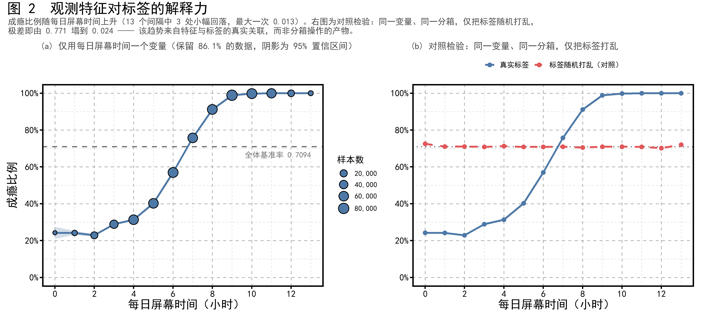
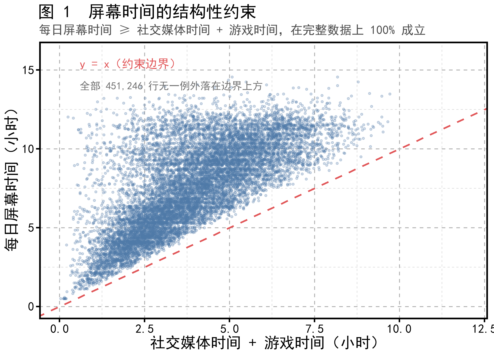
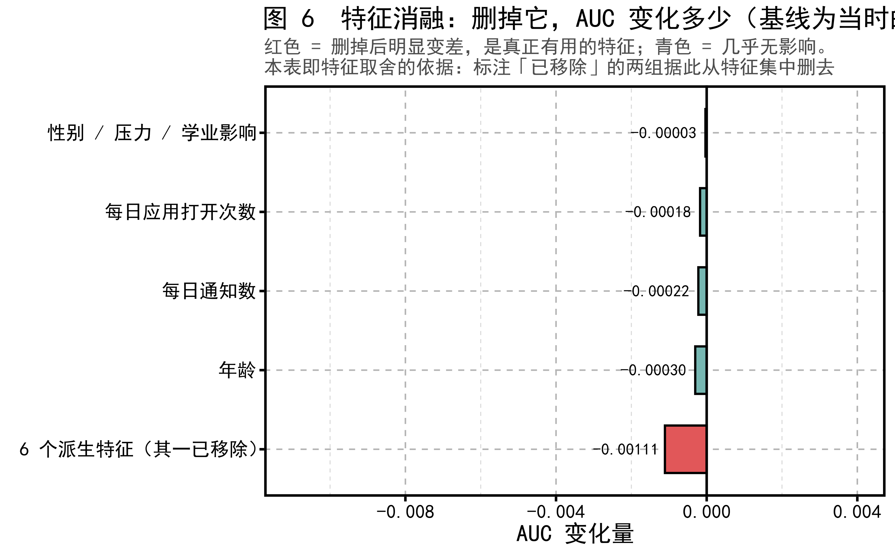
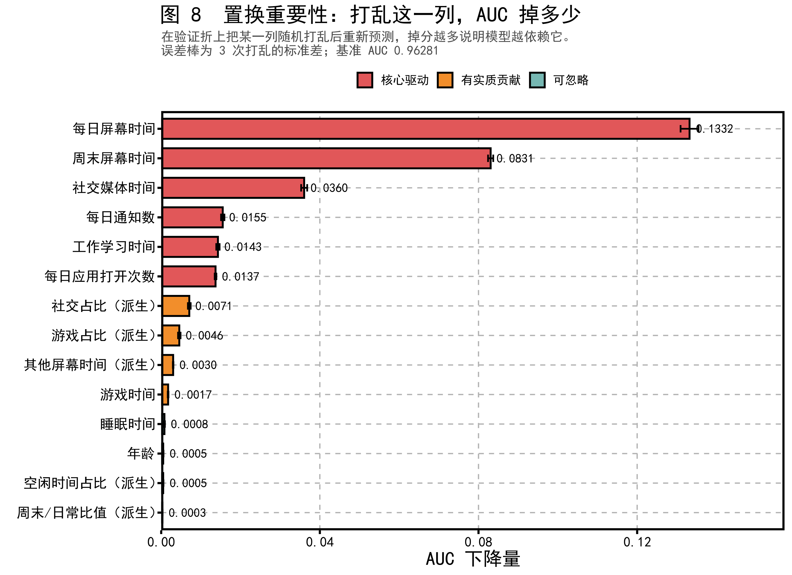
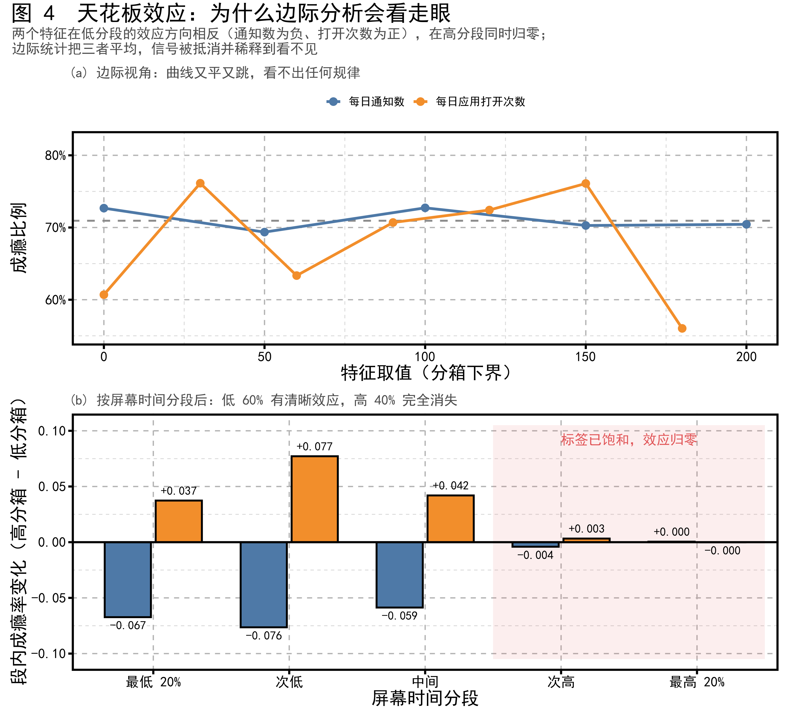
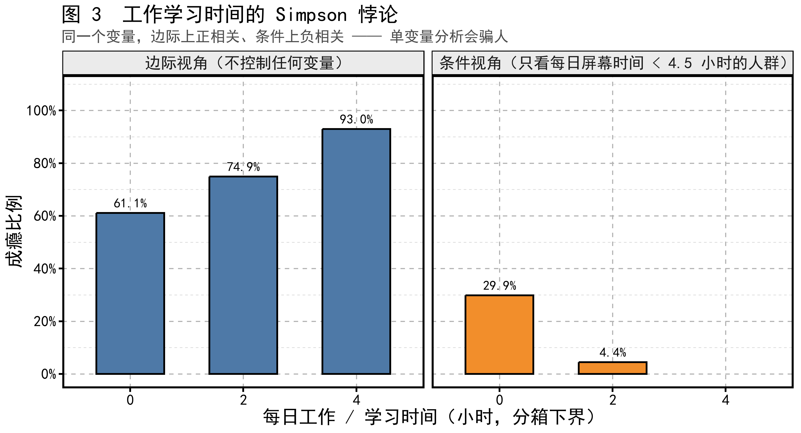

# 智能手机成瘾预测 · 项目总览

> 本文面向组内成员，用于在半小时内建立对本项目的完整认识。
> 阅读本文不需要预先了解机器学习细节；涉及专业概念处均附有解释。
>
> **全部实验结果与结论的统一汇总见 [实验报告.md](实验报告.md)**——
> 本文讲的是"怎么做的、为什么这么做"，那一份讲的是"做出来是什么结果"。
> 两者数字冲突时以实验报告为准。
>
> 更详细的技术推导见 [项目说明.md](项目说明.md)，
> 原始结果表见 [output/results.md](../output/results.md)，
> 当前进度与分工见 [进度.md](进度.md) 与 [小组分工.md](小组分工.md)。

---

## 一、任务复述

### 1.1 要做什么

给定一份用户手机使用行为的记录，预测每位用户是否属于"手机成瘾"。

这是一个二分类问题，但提交内容**不是 0 或 1 的判断，而是一个概率值**。
评价指标为 **ROC-AUC**（ROC 曲线下面积）。

### 1.2 为何采用 AUC 而非准确率

数据中 70.94% 的样本被标记为成瘾。若不加分析地将全部样本预测为"成瘾"，
准确率即可达到 70.94%，但这样的模型没有任何实际价值。

AUC 衡量的是**排序能力**：任取一名成瘾者与一名非成瘾者，
模型给前者打分更高的概率即为 AUC。当模型对所有样本给出相同预测时，
AUC 恰为 0.5，等同于随机猜测。因此 AUC 不会被类别不平衡所掩饰。

这也解释了官方提供的示例提交文件中所有行均填写 `0.7094243450313797`
的原因——该值正是训练集的成瘾比例，代表"不掌握任何信息"的基线。

### 1.3 数据规模

| 项目 | 数值 |
|---|---|
| 训练集 | 691,369 行 |
| 测试集 | 296,302 行 |
| 特征数 | 12 |
| 成瘾比例 | 70.94% |
| **至少缺失一个特征的行** | **61.06%** |

十二个特征包括每日屏幕时间、社交媒体时间、游戏时间、工作学习时间、
睡眠时间、每日通知数、应用打开次数、周末屏幕时间、年龄、性别、
压力水平、学业工作影响。

### 1.4 本题的实质

两项观察共同决定了本项目的方向：

其一，**观测特征对标签的解释力极强**。仅使用每日屏幕时间一个变量，
按 1 小时为间隔分箱统计，成瘾比例即从 24.2% 上升至 99.96%（图 2 左），
该口径保留了 86.1% 的样本。

> **一项对照检验。** 曾有意见认为这类分箱曲线是分箱操作本身的算术产物。
> 我们做了对照：**将标签随机打乱后重复完全相同的分箱步骤**，
> 极差即由 0.771 塌至 0.024，十三个间隔中七处下降（图 2 右）。
> 同一变量、同一分箱，换用随机标签便不再呈现任何趋势，
> 说明单调性来自特征与标签的真实关联。
>
> 该图的早期版本以「屏幕时间 + 社交时间」为横轴，最高箱显示为 100%，
> 曾被质疑"高取值区必然没有阴性样本"。该构造已整体移除（原因见 3.2）。
> 改用单变量之后，**没有任何一个分箱是零阴性的**——
> 最高箱的 2,659 个样本中仍含 1 个阴性样本。
>
> 剔除该列缺失行是否引入选择偏差亦经检验：两组人群的成瘾率为
> 0.7092 与 0.7099，屏幕时间分布的 KS 统计量 D = 0.0085，差异可忽略。
> 完整检验见 `R/15_fig2_audit.R`。

其二，**61% 的样本存在缺失**，且经检验缺失是完全随机产生的，
缺失位置本身不携带任何信息。

因此，本题的难点不在于建立复杂模型，而在于**如何在信息不完整的条件下
恢复判断依据**。这一认识贯穿了整个项目。



---

## 二、工作流程总览

项目按以下顺序推进，每一步的产出都是下一步的输入：

```
原始数据
   │
   ├─→ 探索性分析 ────────→ 9 项数据发现
   │
   ├─→ 特征工程 ──────────→ 25 个建模特征
   │
   ├─→ 折叠划分（冻结） ──→ 全组共享的评价基准
   │
   ├─→ 缺失值处理（4 种方案）
   │        ×
   │   模型拟合（4 种算法）  ──→ 14 组对照实验
   │
   ├─→ 变量筛选（消融实验）→ 特征取舍依据
   │
   ├─→ 超参数搜索 ────────→ 模型配置优化
   │
   ├─→ 集成模型 ──────────→ 最终预测
   │
   └─→ 提交与验证 ────────→ Kaggle 榜单 0.96627
```

其中"折叠划分冻结"是一项关键的工程约定，详见第五节。

---

## 三、特征工程

### 3.1 原始特征的结构性关系

探索性分析发现了一条在数据中**无条件成立**的关系：

```
每日屏幕时间 ≥ 社交媒体时间 + 游戏时间 + 工作学习时间
```

在四列都不缺的 421,427 行中成立 421,427 次，即 **100.0000%**。

> **本节已更正。** 早期版本写的是三项（不含工作学习时间）。两个版本都 100% 成立，
> 但**残差的最小值不同**：三项版停在 0.100，四项版恰好触到 0.000。
> 最小值是判据——**三项版是被四项版蕴含的推论，四项版才是真正的边界**。
>
> 这带来一个语义上的意外：**工作学习时间被算在屏幕时间里面**，
> 也就是"在手机上做的工作/学习"。它直接推翻了我们原来的 3.5 节发现 8。
> 核查脚本 `R/17_discussion_checks.R`，缘由见 `docs/讨论区核查.md`。

屏幕时间本身即由社交、游戏、工作学习及其他用途构成。



此外，周末屏幕时间与每日屏幕时间的相关系数达 0.80，比值稳定在 1.33 左右，
二者互为代理变量。

### 3.2 派生特征的构造

基于上述结构关系，构造了五个派生特征。
**其中前两个的定义在 2026-09-01 被更正过**——原版的"其他屏幕时间"少减了一项，
"空闲时间占比"的分母把工作学习时间减了两遍。缘由见 3.1 与 `docs/讨论区核查.md`。


| 派生特征   | 定义                    | 设计意图         |
| ------ | --------------------- | ------------ |
| **预算余量** | **屏幕时间 − (社交 + 游戏 + 工作学习)** | 生成器强制的四项约束的余量；**树在任何容量下都画不出这个形状** |
| 周末比值   | 周末屏幕 ÷ 每日屏幕           | 刻画作息差异       |
| 社交占比   | 社交时间 ÷ 屏幕时间           | 相对强度而非绝对时长   |
| 游戏占比   | 游戏时间 ÷ 屏幕时间           | 同上           |
| 空闲时间占比 | 屏幕时间 ÷ (24 − 睡眠) | 可支配时间的使用强度（分母已更正，见 3.1） |

> **一个已被删除的派生特征。** 早期版本中还有第六个派生特征
> 「屏幕加社交」，定义为 `屏幕时间 + 社交时间`，并被称为"近似充分统计量"。
> 该构造不成立：由 3.1 可知社交媒体时间本身即是屏幕时间的一个组成部分，
> 二者相加等价于 `2 × 社交 + 游戏 + 其他`，即把社交时间计算了两次。
>
> 三项检验支持删除。其一，若把权重改为可调，即 `屏幕时间 + w × 社交时间`，
> 最优权重为 **w = 1.75**（AUC 0.915）而非 1（AUC 0.912），
> 说明权重 1 只是"两个量相加"这一动作的副产物，而非任何推导的结果。
> 其二，它与自身两个分量的线性回归 **R² = 1.000000**——精确线性组合，
> 不含任何新信息，对树模型是冗余，对线性模型造成设计矩阵秩亏。
> 其三，其置换重要性仅 0.00096，可有可无。
>
> 完整检验保留于 `R/16_screensocial_audit.R`，作为删除该变量的依据。

### 3.3 为什么没有构造交互特征

五个派生特征全部是**差值或比值**，没有一个是乘积、阈值组合或分段交互。
这是有意的取舍，理由有三层。

**其一，树模型本来就在做交互。** 一棵决策树每往下走一层，
就等于在前一次分裂的条件下再切一刀：
"屏幕时间 > 7 小时**并且**通知数 < 80"是一条根到叶的路径，
本身就是一个二阶交互项。上千棵树叠加，可表示的交互组合数量远超人工能枚举的。
因此在树模型上手工构造乘积特征，多数情况下只是把模型自己能学的东西
提前算了一遍。

**其二，本项目最重要的发现恰好就是一个交互效应，而模型是自己找到它的。**
`notifications_per_day` 的边际曲线完全平坦（极差 0.033），
但它只在屏幕时间低的人群里起作用、在高分段完全失效（发现 9）——
这是标准的交互结构。我们**没有**为它构造任何交互特征，
消融却显示删掉它 AUC 掉 0.00825，是全项目最大的单特征损失。
**模型已经把这个交互学到了。**

> ⚠ 那个 0.00825 是**编码之前**的数字。25 特征口径下重跑是 −0.00022——
> 不是这一列变得不重要了，而是它的信息现在有第二条通路
> （`te_notifications_per_day`），"删掉原始列"不再等于"拿走这份信息"。
> 见 [实验报告.md](实验报告.md) 第 5.3 节。

**其三，比值是树模型学不好的那一类，所以才值得手工给。**
这也解释了为什么保留的五个偏偏都是比值与差值：
`社交 ÷ 屏幕 > 0.4` 在（社交, 屏幕）平面上是一条**过原点的斜线**，
而树只能画横竖两种切线，要逼近一条斜线得用许多级台阶。
乘积型交互对树是廉价的，比值型边界对树是昂贵的——
所以人工特征的合理分工，是补树的短板，而不是替它做它擅长的事。

不过这条推理当初只讲了一半，而**另一半后来推翻了我们自己的结论**。

比值特征确实没有带来提升——但**并非所有人工特征都如此**，关键在于**需要几项**。
一次分裂是"一个特征、一个阈值"。两列的比值是一条过原点的斜线，
树用足够多级台阶能逼近；而**四项**的边界（`屏幕 − 社交 − 游戏 − 工作学习`）
要树用矩形去铺一张超平面，**无论多深都到不了**。

我们原来的"其他屏幕时间"恰好**只有三项**（少减了工作学习时间），
而三项的边界树是铺得出来的。把它改成正确的四项之后，
它成为**唯一一个在逐取值编码之上仍然有效的派生特征**（+0.00064，五折同号），
而"提高分箱上限""提取小数位"这两项则被编码完全吸收。

> **所以正确的说法不是"派生特征无效"，而是：**
> **树能自己铺出来的形状，你给了只是稀释；树铺不出来的形状，你给了就是新信息。**
> 我们当初测出"无效"，是因为那个特征算错了。

### 3.4 特征计算的时序要求

派生特征全部是比值或差值，**只要任一分量缺失，结果即为缺失**。
因此在流程上必须遵守一条次序：**先填补缺失值，再计算派生特征**。

这一约束已固化在代码框架中（`R/06_framework.R`）。

### 3.5 特征集的删减

最终进入模型的特征共 **25 个**：原始 12 个 + 派生 5 个 + 逐取值编码 8 个（见 3.6）。
以下两组特征曾存在于特征集中，经实验检验后已删除。

**（一）缺失指示变量（12 + 1 = 13 个）**

Kaggle 竞赛中有一种常见做法：为每一列附加一个"此处是否缺失"的 0/1 变量，
再加一个"该行共缺几个"的计数，理由是缺失位置本身往往携带信息
（例如收入较高者倾向于不填收入）。

本项目构造这组变量，目的是**检验这一假设在本题是否成立**。检验结论为否：
十二列的"缺失时成瘾率"与"未缺失时成瘾率"之差全部小于 0.0042（发现 6）；
消融实验中删去全部十三列，AUC 变化 **+0.00003**（p = 0.448）；
置换重要性全部不超过 0.00001，其中十一个为负值。

**它们是诊断变量，不是预测变量。** 诊断结论既已确定，
就没有理由继续留在特征集中。若需复现该项检验，可执行：

```r
WITH_NA_INDICATORS <- TRUE
FORCE_REBUILD <- TRUE
source("R/03_features.R")
```

**（二）派生特征"屏幕加社交"**

理由见 3.2：它把社交时间计算了两次，且是自身分量的精确线性组合。

**（三）五个派生特征：其中一个有效，四个无效**

需要如实说明：五个派生特征里，**只有"预算余量"一个是有效的**。

它是那个四项残差，**是树在任何容量下都画不出的形状**，因此即便在逐取值编码
已经存在的条件下，它仍然值 **+0.00064**（五折同号）。

其余四个（周末比值、社交占比、游戏占比、空闲时间占比）全部是比值，
而比值是树能用台阶逼近的形状，因此没有可测量的贡献。
保留它们的理由与前两组不同：它们**构造依据明确、不含重复计数**，
且"无效"本身是本项目的一项结论。如需关闭，框架提供开关 `USE_DERIVED=0`。

> ⚠ **2026-09-03 补充：整组删掉的代价比逐个看要大。**
> 25 特征口径下重跑消融，**一次性删掉全部五个派生特征掉 0.00111**
> （Cohen's d −7.95，5/5 折同号），而不是"只有一个有效"所暗示的 0.00064。
> 置换重要性也显示社交占比（0.00652）与游戏占比（0.00434）并非零贡献。
>
> 更准确的说法是：**预算余量是唯一一个能在编码之上单独测出贡献的**，
> 四个比值单独看都在噪声内，但合起来仍有可测量的作用。
> 现役数字见 [实验报告.md](实验报告.md) 第 5.2、5.4 节。

> **一处重要的自我更正。** 本节的早期版本写的是"五个派生特征全部未产生正面作用"。
> 那个结论是在"其他屏幕时间"**算错**（少减一项）的前提下测出来的。
> 改正定义后重测，它变成了有效的那一个。详见 3.3 与 `docs/讨论区核查.md`。

### 3.6 逐取值 target encoding —— 本项目单项收益最大的一步

**背景。** 发现 10、11 表明：这份数据是生成出来、并被舍入到一个格点上的，
所以**精确取值本身携带信息**，而且这个信息是**非单调**的——
把取值当成一个量级去分裂，捕捉不到"5.23 这个值恰好对应什么"。

**做法。** 对八个数值列，把每个不同取值映射为该取值上的平滑目标均值：

```
enc(v) = (该取值的正例数 + 全局均值 × m) / (该取值的样本数 + m)      m = 20
```

**纪律：编码器只在每一折的训练部分拟合**，与缺失值填补是同一条规矩。
（讨论区有一个现成的反例：有人在交叉验证循环之外拟合编码器，
本地分数虚高，改到折内后榜单成绩大跌。）

**效果（Tier A，冻结折叠，xgboost）：**

| 配置 | 特征数 | 交叉验证 AUC | 差值 |
|---|---|---|---|
| 原 17 特征 | 17 | 0.96107 | — |
| **加入编码 + 更正定义** | **25** | **0.96562** | **+0.00455** |

五折差值分别为 +0.00410 / +0.00415 / +0.00433 / +0.00567 / +0.00452，
**五折同号**，Cohen's d = 7.07。这是本项目一致性最高的一次实验。

**它比我们此前的任何一项工作都大：**

| 来源 | 收益 |
|---|---|
| **本次** | **+0.00455** |
| 四种缺失处理方案之间的最大差距（整个专题研究） | 0.00297 |
| 引入早停 | +0.00178 |
| 超参数搜索 | +0.00066 |

**一个必须说明的对照。** 我们同时测了另外两种"提高取值分辨率"的做法——
提高分箱上限（`max_bin` 2048）与提取小数位特征。二者单独使用时都有效
（+0.00091、+0.00086），但**在编码已经存在的条件下，它们的贡献归零**
（+0.00003、+0.00005，五折中仅 2 折、3 折同号）。

三者做的是同一件事，**互为替代而非可叠加**。编码做得最彻底，因此被采用；
另外两项不进最终配置。

---

## 四、变量筛选

### 4.1 筛选方法

本项目采用**消融实验**作为变量取舍的依据：逐一移除某个特征或某组特征，
在完全相同的评价条件下重新训练模型，观察 AUC 的变化量。
下降越多，说明该特征越不可替代。

同时计算了**置换重要性**作为交叉验证：在验证集上将某一列的取值随机打乱，
重新预测并观察 AUC 下降幅度。该指标衡量的是"已训练好的模型对该列的依赖程度"。

### 4.2 消融结果

> ⚠ **本节是当初做特征取舍时的依据，基线是 31 特征（编码之前）。**
> 2026-09-03 在 25 特征口径下重跑后，其中两行发生了实质变化：
> 「删掉每日通知数」的损失从 −0.00825 缩到 **−0.00022**（缩小 37 倍），
> 「删掉派生特征」从 +0.00012 反转为 **−0.00111**。
> **现役数字见 [实验报告.md](实验报告.md) 第 5.2、5.3 节。**
> 本节保留，因为它记录的是当时**为什么那样取舍**——那个决策依据本身没有变。



下表是特征取舍的直接依据。基线为当时的 31 特征配置，
每一行表示移除该组特征后 AUC 的变化量：

| 移除对象             | AUC 变化         | 处置                    |
| ---------------- | ------------- | --------------------- |
| 每日通知数            | **−0.00825**  | 保留（不可移除）              |
| 每日应用打开次数         | **−0.00705**  | 保留（不可移除）              |
| 12 个缺失指示 + 缺失计数   | +0.00003      | **已移除**               |
| 性别、压力水平、学业工作影响   | +0.00009      | 保留（题目给定的原始特征）         |
| 年龄               | +0.00001      | 保留（题目给定的原始特征）         |
| 6 个派生特征          | +0.00012      | 其中「屏幕加社交」**已移除**，余五个保留 |

依据上表，特征集由 31 个减为 **17 个**。在两个代表性模型上重新测量：

| 模型            | 31 特征              | 17 特征               | 差值        | 逐折同号 |
| ------------- | ------------------ | ------------------- | --------- | ---- |
| xgboost（L1）   | 0.96088 ± 0.00125  | **0.96107 ± 0.00121** | +0.00019  | 4/5  |
| glmnet（L3）    | 0.92825 ± 0.00124  | 0.92814 ± 0.00123   | −0.00010  | 5/5  |

**两者符号相反**，但量级都在万分之二以内。对梯度提升树，删减略有改善；
对带惩罚的线性模型，删减轻微有害——因为线性模型无法原生表示"未知"，
插补之后只有缺失指示还记得"这一行是猜出来的"；而 `屏幕加社交` 这一列
让"同时给屏幕和社交加权"可以由一个系数承担，在惩罚下是更便宜的路径。

这与 9.1 的核心发现是同一回事。最终提交由梯度提升树集成产生，
glmnet 在其中权重很低，因此该项差异不影响交付。

### 4.3 置换重要性



在**当前的 25 特征配置**上计算的结果如下：

| 特征 | 置换重要性 | 增益占比 |
|---|---|---|
| 取值编码：每日屏幕时间 | **0.0795** | 34.9% |
| 取值编码：周末屏幕时间 | **0.0513** | 12.9% |
| 取值编码：每日通知数 | 0.0183 | 7.5% |
| 取值编码：每日应用打开次数 | 0.0147 | 6.4% |
| 取值编码：社交媒体时间 | 0.0095 | 5.2% |
| 周末屏幕时间（原始） | 0.0080 | 3.1% |
| 工作学习时间（原始） | 0.0080 | 1.4% |
| 社交占比（派生） | 0.0065 | 6.1% |
| **每日屏幕时间（原始）** | **0.0061** | 6.9% |
| 预算余量（派生） | 0.0058 | 1.1% |
| 其余十五个特征 | < 0.005 | — |

**这张表相对上一版发生了根本变化，值得单独说明。**

在 17 特征配置下，`每日屏幕时间` 的置换重要性是 **0.1332**，遥遥领先。
加入逐取值编码之后，它掉到 **0.0061**——**排到了第九位**，
而它的编码版本以 0.0795 占据首位。

**原始列并没有变得不重要，是它的信息被编码列更好地承载了。**
打乱原始列时，模型可以从编码列把同样的信息读回来；反过来则不行，
因为编码携带的是原始列的单调排序**捕捉不到**的那部分（发现 10、11）。

同样的替代发生在通知数上：原始列从 0.0155 掉到 0.0004，
而 `取值编码：每日通知数` 是 0.0183。

> ⚠ **这也说明 4.2 的消融表已是历史口径。** 那张表是在加入编码**之前**测的，
> 其中"删掉每日通知数 −0.00825"描述的是一个不再存在的配置。
> 在当前配置下，删掉原始通知数很可能代价小得多，因为编码列顶得上。
> **该消融尚未在新配置下重跑**（约需 3 小时），在重跑之前，
> 4.2 应按"加入编码之前"的口径理解。

关于**周末屏幕时间**的老观察仍然成立：它的编码版位居第二。
该变量与每日屏幕时间高度相关、看似冗余，但当每日屏幕时间缺失时（占 13.86%），
它是最可靠的替代来源。**冗余变量在存在缺失的场景下具有实质价值。**

### 4.4 三种重要性口径的分歧

模型内建的"增益重要性"与置换重要性给出的排序并不一致。
在当前配置下，最清楚的一处倒挂是：

| 特征 | 增益占比 | 置换重要性 |
|---|---|---|
| 每日屏幕时间（原始） | 6.9% | 0.0061 |
| 社交媒体时间（原始） | 6.1% | 0.0053 |
| 取值编码：社交媒体时间 | 5.2% | **0.0095** |

两个原始列的**增益占比高于**那个编码列，**置换重要性却低于它**。

这一分歧有明确解释。增益重要性统计的是"该特征在树的分裂中被使用的程度"，
取值连续的原始列可被反复切分，容易累积较高的增益；
置换重要性衡量的则是"打乱该列之后模型是否仍能正常工作"。
**原始列被频繁使用，但一旦打乱，模型立即改用编码列替代，因而并非不可或缺。**

该现象在更早的配置里也出现过：已被删除的「屏幕加社交」增益占比曾高达 9.41%、
位居第三，置换重要性却仅 0.00096——这正是判定其为冗余的证据之一。

**结论：评估特征价值时应以置换重要性与消融实验为准，
增益重要性仅可作为参考。**

### 4.5 无贡献特征的处置

上述实验共确认四组无贡献特征。项目对它们采取了不同处置：

| 特征组             | 处置  | 理由                                              |
| --------------- | --- | ----------------------------------------------- |
| 缺失指示（13 个）      | 移除  | 用于检验"缺失位置是否携带信息"的诊断变量，检验结论为否，本就不属于预测变量          |
| 屏幕加社交（1 个）      | 移除  | 定义上把社交时间计算了两次，且是自身分量的精确线性组合                     |
| 其余五个派生特征        | 保留  | 构造依据明确、无重复计数，其"无效"本身是本项目的一项结论；如需关闭有开关 `USE_DERIVED=0` |
| 性别、压力、学业影响、年龄   | 保留  | 属题目给定的原始特征，不做删减                                 |

需要说明的是，这些取舍对分数的影响都在 ±0.0002 以内。
**没有一项是为了提高名次做的**——移除的两组是因为它们在概念上站不住，
保留的两组是因为删掉它们没有依据。

---

## 五、模型拟合

### 5.1 评价基准的统一

在开展任何建模工作之前，项目首先固定了一套**交叉验证折叠划分**，
将 691,369 个训练样本按标签分层随机划分为五份，并将结果保存为文件
（`output/folds.rds`），生成后不再变动。

### 5.2 防止信息泄漏的处理次序

缺失值填补本身需要从数据中学习规律（例如"屏幕时间缺失时如何估计"）。
若在全部训练数据上学习这一规律，再用于评价，
则验证部分的信息会通过填补参数间接进入训练过程，导致分数虚高。

因此框架强制规定：**填补模型只能在每一折的训练部分上拟合**，
再用于变换训练部分与验证部分。

### 5.3 四种缺失值处理方案

| 方案  | 处理方式           | 特点       |
| --- | -------------- | -------- |
| L1  | 不填补，保留缺失       | 仅部分算法支持  |
| L2  | 填入该列的中位数       | 最常见的做法   |
| L3  | 用其他变量回归估计      | 利用变量间相关性 |
| L4  | 从相似样本中随机抽取真实取值 | 保留原始分布形态 |

### 5.4 四种算法

| 算法       | 类型      | 能否处理缺失 |
| -------- | ------- | ------ |
| xgboost  | 梯度提升树   | 可以     |
| lightgbm | 梯度提升树   | 可以     |
| ranger   | 随机森林    | 不可以    |
| glmnet   | 正则化逻辑回归 | 不可以    |

四种缺失处理方案与四种算法交叉，构成 14 组对照实验
（ranger 与 glmnet 无法使用 L1，故为 14 组而非 16 组）。

### 5.5 计算资源的分配

完整数据为 69 万行，若全部实验均在全量上进行，计算时间无法接受。
项目因此采用两级设计：

- **对照实验**在分层抽取的 20 万行子样本上进行，用于方法比较；
- **最终候选模型**在全量 69 万行上重新训练。

事后验证表明，两种规模下模型的排序完全一致（Spearman 相关系数 1.000），
说明子样本上的结论可以外推至全量。

---

## 六、超参数搜索

### 6.1 训练轮数

梯度提升树需要指定训练轮数。项目初期采用固定值 600 轮，
这一数值缺乏依据。改为**早停机制**后——即在训练过程中持续监控表现，
当不再改善时自动停止——模型自动选择的轮数约为 1158 轮。

| 设置       | 交叉验证 AUC    |
| -------- | ----------- |
| 固定 600 轮 | 0.95910     |
| 早停自动确定   | **0.96088** |

### 6.2 参数网格搜索

在早停基础上，对学习率与树深度进行了两阶段搜索，共评估 18 组配置。

| 配置 | AUC |
|---|---|
| 默认（学习率 0.05，深度 6） | 0.96078 |
| 最优（学习率 0.05，**深度 4**） | **0.96145** |

搜索结果显示**较浅的树表现更好**。这与第一节所述的数据特性一致：
标签近似为少数几个变量的单调函数，不需要很深的树来刻画复杂交互。

### 6.3 结论的稳健性检验

一个合理的质疑是：四种缺失处理方案的优劣排序，
是否只在特定超参数下成立？

为回答此问题，项目使用搜索得到的最优参数重新运行了四条实验线。
结果显示排序保持不变，**结论不依赖于超参数的选择**。

## 七、集成模型

### 7.1 基本思路

集成是指将多个模型的预测结果合并，以期获得优于任何单一模型的表现。
其效果取决于成员之间的**差异性**——若各模型在相同样本上犯相同错误，
合并不会带来改善。

项目比较了三种合并方式：

| 方式 | 原理 |
|---|---|
| 二层逻辑回归 | 以各模型预测为输入，训练一个新模型学习权重 |
| 排序平均 | 将各模型预测转为排名后取平均 |
| 爬山法 | 逐步选入模型，每次选择使整体表现提升最多的一个 |

### 7.2 成员选择

初期按 AUC 高低选取前五名，结果全部为梯度提升树，
彼此之间的排序相关系数高达 0.991–0.996，实质上是同一模型的多个副本。

调整为**按算法类别各取其最优者**后，随机森林与逻辑回归得以进入，
成员间最低相关系数降至 0.939。

### 7.3 结果


| 合并方式 | 编码前（9 成员） | 全量 + 编码（**14 成员**） |
|---|---|---|
| 二层逻辑回归（概率） | 0.96458 | 0.96720 |
| 排序平均 | 0.96263 | 0.96485 |
| 爬山法 | 0.96487 | 0.96802 |
| **秩空间逻辑回归** | **0.96511** | **0.96807** ← 最优 |
| 最优单一模型 | 0.96465 | 0.96784 |

**两个口径下，集成相对最优单一模型都只提升约 0.0002**（+0.00046 与 +0.00023）。
换方法并没有解决这个问题——**候选同质才是根因**。

"秩空间逻辑回归"是赛后新增的方法：与二层逻辑回归的唯一差别是**先把每个成员
换成它自己的秩**再拟合。AUC 只看秩，而各成员并未校准到同一尺度
（逻辑回归与梯度提升树的输出分布完全不同），在概率空间加权等于把各自的校准
也一起加权了。它在两个口径下都是最优。

需要说明的是，排序平均的表现反而低于最优单一模型，
原因是该方法对所有成员一视同仁，
而逻辑回归与随机森林的水平明显低于梯度提升树。
爬山法能够自动压低这两者的权重，因此是三种方式中唯一带来改善的。

### 7.4 对集成效果的评价

本项目中集成的收益有限，原因是客观存在的：
候选模型中存在一个明显占优者，且多数成员高度同质。

**在此类情形下，集成本身价值不大。**

---

## 八、最终结果

### 8.1 成绩演进

| 阶段 | 交叉验证 AUC | 口径 |
|---|---|---|
| 初始基线（固定轮数、默认参数） | 0.95910 | Tier A |
| 引入早停 | 0.96088 | Tier A |
| 加入超参数搜索 | 0.96145 | Tier A |
| 最优单一模型（全量训练） | 0.96465 | 全量，**编码前** |
| 九成员集成 —— **提交到榜单的就是它** | 0.96487 | 全量，**编码前** |
| —— 以下为赛后改动 —— | | |
| 更正两处定义 + 逐取值编码（最优单模型 L1_xgboost） | **0.96784** | 全量，25 特征 |
| 十四成员集成（秩空间 logistic） | **0.96807** | 全量，25 特征 |

**赛后单模型 0.96784 已超过赛前整个九成员集成 0.96487，高出 0.00297。**

> ⚠ **赛后的两行没有榜单验证。** 比赛于 2026-08-31 结束，最终榜单成绩是
> **0.96627**，对应表中的九成员集成。按已验证的 CV↔榜单关系（+0.0014）外推，
> 0.96807 大致对应 0.9694，但**这只是外推，不是成绩**。

### 8.2 本地验证与榜单的一致性

两次提交的结果如下：

| 提交 | 本地交叉验证 | Kaggle 榜单 | 差值 |
|---|---|---|---|
| 第一次 | 0.96477 | 0.96613 | +0.00136 |
| 第二次 | 0.96487 | **0.96627** | +0.00140 |

榜单成绩略高于本地验证，且差值稳定。这一差异有明确解释：
交叉验证中每个模型仅使用五分之四的数据训练（约 55 万行），
而生成提交结果的模型使用了全部 69 万行。

第二次提交前，项目依据此关系预测榜单成绩为 0.96623，
实际结果为 0.96627，**误差 4×10⁻⁵**。

## 九、关键发现

### 9.1 预处理的价值取决于模型自己能做到什么

这是本项目的核心结论。它最初来自缺失值处理，现在有**三个相互独立的实例**，
且**方向完全一致**：

| 预处理 | 模型能否自行做到 | 梯度提升树上 | 线性模型上 |
|---|---|---|---|
| **填补缺失值** | 树能原生表示"未知"；线性模型不能 | 越复杂越差（−0.00105） | **+0.01065** |
| **派生比值特征** | 树能用台阶逼近斜线；线性模型造不出比值 | ≈ 0（+0.00010） | **−0.00357** |
| **逐取值编码** | 树能用上千次分裂逼近；线性模型**在原始尺度上**不能 | **+0.00424** | **+0.03352** |

> **统一的表述**：
> **一项预处理的价值，等于该变换有多难被下游模型自己造出来。**
>
> 模型能自行做到的，给了只是稀释；模型做不到的，给了就是新信息。
> 而"能否做到"是模型**表达能力**的性质，不是数据的性质——
> 因此同一项预处理在不同模型上可以有**相反的符号**。

第三行的完整测量（Tier A，冻结折叠）：

| 算法 | 编码前 | 编码后 | 差值 | 五折同号 |
|---|---|---|---|---|
| xgboost | 0.96138 | 0.96562 | +0.00424 | 5/5 |
| lightgbm | 0.96039 | 0.96514 | +0.00475 | 5/5 |
| ranger（随机森林） | 0.94058 | 0.96096 | **+0.02039** | 5/5 |
| glmnet（线性） | 0.91452 | 0.94805 | **+0.03352** | 5/5 |

两点值得注意：

- **线性模型的收益是梯度提升树的八倍。** 它从 0.9145 升至 0.9481，
  一次预处理改动即消除了它与树模型之间约三分之一的差距。
- **随机森林启用编码后（0.96096），已接近 xgboost 未启用编码时的水平（0.96138）。**
  对该算法而言，**这一项预处理比更换算法更有价值。**

这三行也解释了为什么"模型族多样性"高的集成会更强：
**不同族的模型不仅预测不同，它们对同一项预处理的需求也不同。**

> **一处更正与延伸（2026-09-01）。** 上表第三行原写作"线性模型**完全**不能"，
> 那是说过头了。竞赛讨论区有人报告纯逻辑回归可达 0.96，我们复现后确认：
> 把逐取值信息以 **one-hot**（每个取值一个自由参数）而非 target encoding
> （每个取值压成一个数）喂给线性模型，全量上从 0.94805 升到 **0.95929**。
>
> 正确的说法是：**线性模型无法在原始尺度上表示非单调查找，
> 但给它足够的参数就能做到。做不到的不是"查找"，是"不增加参数地查找"。**
>
> 这不削弱本节结论，反而给它加了一个刻度：同一份逐取值信息，
> 三种形式（原始值 0.91452 / 编码 0.94805 / one-hot 0.95929）差出 0.045。
> **形式本身就是在补模型缺的那部分表达能力。**
> 完整测量见 `R/24_onehot_lr.R` 与 `docs/讨论区核查.md` 第十三节。

### 9.2 边际分析可能得出完全错误的结论

项目在探索性分析阶段，依据单变量的分箱统计，
将每日通知数与应用打开次数判定为"无信息量的噪声"。
消融实验推翻了这一判断——二者恰恰是除屏幕时间外最重要的特征。



**误判原因有二**：

其一，**天花板效应**。将样本按屏幕时间分为五段后，
两个变量在标签尚未饱和的低 60% 区间存在清晰效应
（成瘾率变化 0.046–0.086），而在高 40% 区间效应完全消失
（变化不超过 0.006）——该区间内屏幕时间已将所有人推至接近 100%，
任何其他变量都无法再产生影响。单变量统计将两段平均，信号被稀释。

其二，**方向相反**。通知数越多，成瘾比例越**低**；
应用打开次数越多，成瘾比例越**高**。二者在汇总统计中相互抵消。

这一方向差异本身具有解释价值：
**通知是被动接收的，应用打开是主动发起的。
主动使用行为预测成瘾，被动接收则不然。**

同一份数据中还存在另一个同类案例（图 3）：
工作学习时间在边际统计上与成瘾正相关，
但在控制屏幕时间后转为负相关，即统计学中的 Simpson 悖论。



> **本数据集中，任何基于单变量边际统计的结论均不可轻信。**


---

## 十、改进与经验

### 10.1 已完成的改进

项目中期接受了一次系统的方法学审查，共提出 13 项问题，
其中 12 项已修正，1 项经论证后未予采纳。主要改进包括：

| 问题 | 处理 |
|---|---|
| 训练轮数固定，无早停 | 引入折内早停，收益 +0.00178 |
| 未进行超参数搜索 | 完成两阶段搜索并验证结论稳健性 |
| 统计检验样本量不足 | 通过重复交叉验证将配对样本量由 5 提升至 15 |
| 模型文件大量重复 | 重构为三层结构，单文件由 210 行降至 27 行 |
| 缺少环境依赖记录 | 生成 `renv.lock`，记录 60 余个依赖包的精确版本 |
| 缺少概率校准评估 | 补充 Brier 分数与校准曲线分析 |

### 10.2 未采纳的一项建议及其理由

审查建议将配对 t 检验更换为 Wilcoxon 符号秩检验，
理由是样本量为 5 时 t 检验的正态性假设无法验证。
该问题诊断成立，但所建议的方法会使情况恶化。

样本量为 5 时，符号秩统计量仅有 2⁵ = 32 种可能排列，
**双侧 p 值的下限为 2/32 = 0.0625**，永远无法达到 0.05 的显著性水平。

项目通过实测验证了这一点：四组比较在样本量为 5 时的符号秩 p 值
**全部等于 0.0625**，其中包括一组效应量高达 32 倍标准差、
五折方向完全一致的比较。

正确的处理方式是**增加样本量**。项目采用三组不同的划分方式
各进行一次完整的五折交叉验证，将配对样本量提升至 15，
此时符号秩 p 值降至 0.0001–0.0043，检验恢复了分辨能力。

### 10.3 若重新开始，应当调整的顺序

依据本项目的实际收益分布，建议的工作顺序为：

1. **先做基础配置**——早停、超参数搜索。成本低，收益明确。
2. **再做特征与变量分析**——消融实验的信息量远高于单变量统计。
3. **最后考虑方法创新**——在本题中，缺失值处理方案的收益低于预期。
4. **集成放在最后且不必期望过高**——在存在明显占优模型时收益有限。

### 10.4 值得保留的做法

以下几项在项目中发挥了实际作用，建议在类似工作中沿用：

- **固定并冻结评价基准。** 全组共享同一套折叠划分，
  使得任意两人的结果可以直接比较。
- **将关键约束写入代码框架而非文档。** 例如填补必须在折内进行这一规定，
  写在注释中可以被忽略，写在框架中则无法绕过。
- **如实记录未达预期的结果。** 特征工程无效、集成收益有限、
  多项假设被推翻——这些记录构成了本项目最有价值的部分。

---

## 附录

### A. 主要文件索引

| 路径 | 内容 |
|---|---|
| `R/01_load.R` – `R/04_folds.R` | 数据读取、特征工程、折叠划分 |
| `R/05_impute_L1.R` – `L4.R` | 四种缺失值处理方案 |
| `R/lib_models.R` | 四种算法的统一封装 |
| `R/06_framework.R` | 交叉验证框架（含防泄漏约束） |
| `R/06_model_*.R` | 14 组实验配置，每个 27 行 |
| `R/09_ablation.R` | 消融实验 |
| `R/10_tune.R` | 超参数搜索 |
| `R/12_figures.R` | 全部图表 |
| `R/13_importance.R` | 特征重要性 |
| `R/07_ensemble.R` / `R/08_submit.R` | 集成与提交 |

### B. 复现方式

```bash
# 一次性跑完全部实验
Rscript R/run_pipeline.R

# 生成图表与特征重要性
Rscript R/12_figures.R
Rscript R/13_importance.R
```

数据文件未纳入版本管理，需自行从竞赛页面下载并置于 `data/raw/`。
依赖包可通过 `renv::restore()` 按 `renv.lock` 记录的版本还原。

### C. 图表清单

| 编号 | 主题 | 用途 |
|---|---|---|
| 图 1 | 屏幕时间的结构性约束 | 说明数据特性 |
| 图 2 | 标签的单调性 | 说明任务实质 |
| 图 3 | Simpson 悖论 | 论证边际分析的局限 |
| 图 4 | 天花板效应 | **核心发现之一** |
| 图 5 | 缺失处理与模型的交互 | **核心发现之二** |
| 图 6 | 特征消融 | 变量筛选依据 |
| 图 7 | 本地验证与榜单的对应 | 验证方案可信度 |
| 图 8 | 置换重要性 | 特征价值排序 |

图片文件位于 `reports/figures/`，分辨率 300 dpi，可直接用于汇报材料。
