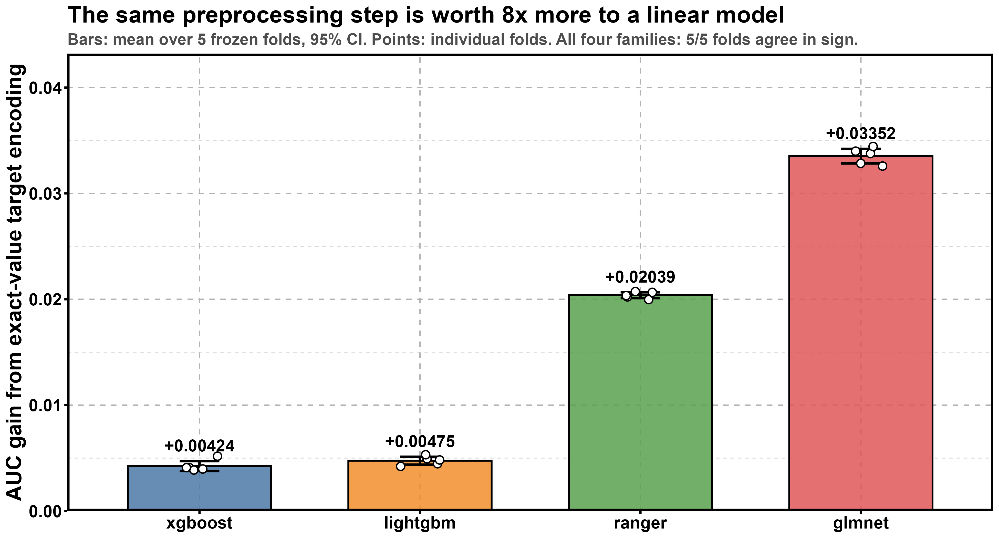
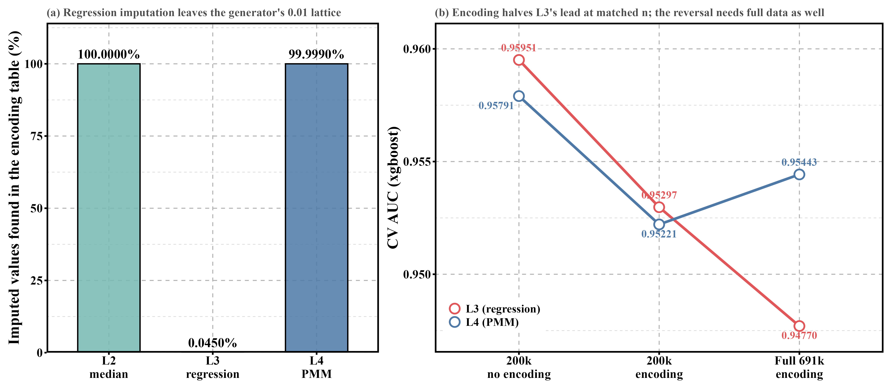
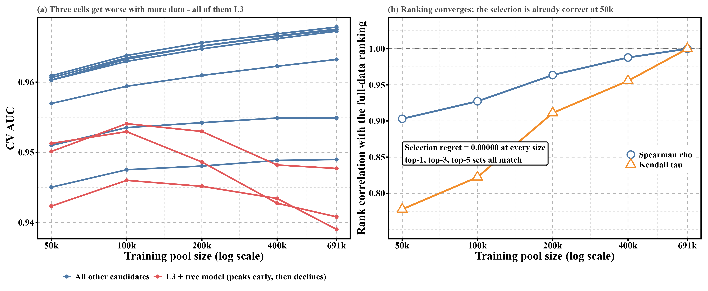

# The Value of a Preprocessing Step Is the Cost of Reconstructing It: Evidence from a Smartphone Addiction Prediction Task

[Author Name]  
[Student ID]  
[Affiliation]

---

## Abstract

Predicting smartphone addiction from behavioral and usage data is, on this dataset, less a modeling problem than a missing-data problem: 61.06% of rows are missing at least one feature, while the label is almost fully determined once the data are complete. This creates a concrete, practically motivated version of an old question — which missing-value treatment is best — that turns out to be underdetermined without specifying which model will consume the result. We argue, and test across four model families and three independent preprocessing decisions (missing-value imputation, a derived feature, and exact-value target encoding), that a preprocessing step is worth exactly as much as it is hard for the downstream model to reconstruct on its own. A direct consequence is that the same transform can carry opposite sign depending on the model's expressiveness rather than the data. We further show that two preprocessing steps can destroy each other when one's output leaves the domain the other requires, and, independently, that a model configuration selected cheaply on a subsample transfers to the full dataset with zero selection regret at every scale tested, though the rank inversions that do occur concentrate exactly where that destructive interaction is present. All comparisons use a single frozen cross-validation split and paired, not aggregate, statistics.

---

## 1. Introduction

Smartphone-addiction prediction, as posed here, is a binary classification task built on behavioral and usage variables — screen time, app opens, notifications, sleep, and similar measures. The dataset comes from a Kaggle-hosted competition run as part of coursework, scored by the area under the ROC curve, and it has two properties that shape everything that follows. First, as §2 documents in detail, the label is close to fully determined once a row's features are observed. Second, 61.06% of rows are missing at least one of twelve raw features. Practically, then, the central difficulty is not fitting a sufficiently powerful model; it is deciding what to do with the majority of rows where some of that determining information is absent.

The natural question is which missing-value treatment is best. Asked this way, the question is underdetermined: it has no answer independent of what will consume the imputed values. A treatment that helps one model can hurt another on the identical rows, folds, and features, because the treatment's benefit depends on what the model could already do without it. This paper is an attempt to make that dependency explicit and general, rather than treating each instance — an imputation choice, a derived feature, an encoding — as its own unrelated finding.

We propose, and test across four model families spanning gradient-boosted trees, a random forest, and a regularized linear model, and three independent preprocessing decisions, a single explanatory account:

> A preprocessing step is worth exactly as much as it is hard for the downstream model to reconstruct on its own.

Two consequences follow directly. First, because "how hard to reconstruct" is a property of a model's expressiveness rather than of the data, the same transform can carry opposite sign across model families — helping one and hurting another on identical inputs. Second, when a pipeline chains two preprocessing steps, the output of one can leave the domain the other requires, so the two steps destroy each other's contribution rather than compounding it; to our knowledge this second consequence has not previously been reported.

This paper makes three contributions.

1. We state and test a single account of when a preprocessing step is worth applying — its value equals the difficulty the downstream model would have reconstructing it unaided — across three independent instances (missing-value imputation, a derived feature, and exact-value target encoding) and four model families, and show that the same transform's benefit changes sign, not just magnitude, depending on which model receives it.

2. We identify and trace a failure mode that, as far as we are aware, has not previously been reported: two preprocessing steps in the same pipeline can destroy each other's value when the output of one leaves the domain the other requires. We trace this concretely to an interaction between regression-based imputation and exact-value encoding on this dataset's 0.01-valued lattice, and show the damage is invisible at moderate sample sizes and only visible at full scale.

3. Independently of the above, we test whether a model configuration chosen cheaply — on a 200,000-row stratified subsample rather than the full 691,369-row training set — is the configuration one would have chosen on the full data. Using a five-level sample-size ladder, we find zero selection regret at every level, but the rank inversions that do occur are not random: they concentrate specifically among the configurations subject to the destructive interaction identified in the previous contribution, and the one inversion elsewhere is a pair whose full-data gap lies below its own resolution floor — not a real misranking, but a tie neither sample size can resolve.

The remainder of the paper is organized as follows. §2 describes the dataset and the task in more detail, including the generator's structural properties that later sections depend on. §3 sets out the experimental protocol — the frozen folds, the within-fold fitting discipline, and the statistical standard used to call a difference real — against which every subsequent result is measured. §4 reports the full grid of missing-value treatments crossed with model families; §5–§7 examine the three preprocessing instances behind the paper's central thesis in turn: imputation, a derived feature, and exact-value encoding. §8 shows how two of these preprocessing steps interact destructively. §9 asks whether conclusions reached on a subsample of the data transfer to the full dataset. §10 discusses the results together, and §11 concludes.

---

## 2. Data and Task

This section describes the dataset, the prediction task, and two structural properties of the data-generating process — a hard constraint and a value lattice — that later sections depend on.

### 2.1 Scale and Features

The training set contains 691,369 rows and the test set 296,302 rows, each row describing one user with twelve raw features: nine numeric (`age`, `daily_screen_time_hours`, `social_media_hours`, `gaming_hours`, `work_study_hours`, `sleep_hours`, `notifications_per_day`, `app_opens_per_day`, and `weekend_screen_time`) and three categorical (`gender`, `stress_level`, and `academic_work_impact`). The target, `addicted_label`, is binary; 70.94% of rows are labeled positive (addicted). The task is scored by the area under the ROC curve (AUC; Hanley & McNeil, 1982), and every model comparison in this paper reports AUC on held-out folds (§3).

**Table 1.** Raw features used as model inputs.

| Type | Features |
|---|---|
| Numeric (9) | `age`, `daily_screen_time_hours`, `social_media_hours`, `gaming_hours`, `work_study_hours`, `sleep_hours`, `notifications_per_day`, `app_opens_per_day`, `weekend_screen_time` |
| Categorical (3) | `gender`, `stress_level`, `academic_work_impact` |

A substantial fraction of rows are incomplete: 61.06% are missing at least one of the twelve features (`R/02_eda.R`).

### 2.2 Why Missingness Is the Central Difficulty

Two properties of the data, taken together, determine the shape of the entire experiment. First, the label is close to fully determined once the defining features are observed: binning `daily_screen_time_hours` into 1-hour-wide bins, the addiction rate rises monotonically from 24.2% to 99.96%. This is not an artifact of the binning procedure — repeating the identical binning after randomly shuffling the label collapses the range from 0.771 to 0.024 (`R/15_fig2_audit.R`), confirming that the monotone relationship reflects a real association between the feature and the label rather than a property of the binning itself.

Second, the missingness is uninformative. Across the twelve columns, the largest difference in addiction rate between the rows where a column is missing and the rows where it is observed is 0.0042 — small enough to be consistent with sampling noise rather than a systematic relationship between missingness and the outcome, i.e., missing completely at random (MCAR; Little & Rubin, *Statistical Analysis with Missing Data*). We refer to missingness under this pattern as MCAR throughout.

Together, these two facts reframe the prediction task. If the label were only weakly related to the features, a more powerful model would matter more than complete data. If missingness carried information about the label — for example, if users who did not report their screen time were disproportionately likely to be addicted — the missingness pattern itself would be a usable feature. Neither holds here: the signal is strong when the data are complete, and the incompleteness is uninformative about which rows are missing. What remains is a narrower, more concrete question: given that 61.06% of rows have some of that signal removed, how much of it can be recovered, and by what means?

### 2.3 The Generator's Structure: A Four-Term Constraint and a 0.01 Lattice

The training and test data were synthetically generated for the competition, inspired by the Smartphone Addiction Prediction Dataset, and the generator leaves two structural fingerprints in the data that matter for later sections.

First, a hard constraint holds among four of the time-use features:

```
daily_screen_time_hours ≥ social_media_hours + gaming_hours + work_study_hours
```

Among the 421,427 rows where all four columns are observed, the inequality holds in 100.0000% of rows, and the minimum residual (the left side minus the right side) is exactly 0.000 (`R/17_discussion_checks.R`) — the constraint is occasionally tight. An earlier version of this check used only three terms, omitting `work_study_hours`; that version also held in 100% of rows, but its minimum residual was 0.100, not 0.000. Because the three-term inequality is implied by the four-term one — dropping a non-negative quantity from the right-hand side can only relax the inequality — the 0.100 minimum shows that the three-term version was never actually tight. It is a consequence of the true, four-term constraint rather than a boundary in its own right, and it is the four-term relation that we treat as the generator's real structural rule throughout this paper.

Second, feature values are generated on a 0.01 grid, and the second decimal digit of a value correlates with the row's positive rate. This lattice structure is a property of the generator, not of the underlying construct being measured; §8 shows that it interacts consequentially with how missing values are imputed.

### 2.4 Post-Competition Status

The competition this dataset was drawn from ended on August 31. Most of the numbers reported in this paper — including the corrected four-term constraint above and the exact-value encoding described in later sections — were computed after that date, and none of them have leaderboard verification: there is no live scoring system left to check them against beyond the frozen validation folds described in §3. This paper reports local, cross-validated results throughout; no leaderboard placement or ranking is claimed anywhere, and any value obtained by extrapolating beyond what was directly measured is flagged as an extrapolation at the point it is used.

---

## 3. Experimental Protocol

This section sets out the protocol shared by every comparison in this paper: how the data are split, how label-dependent transforms are fit, how a difference is judged real rather than noise, and what can and cannot be reproduced exactly.

### 3.1 Frozen Folds

All comparisons in this paper share a single 5-fold cross-validation split, generated once, stratified by label, with random seed 20260821, and stored rather than regenerated. `R/04_folds.R` — the script that produces it — refuses to overwrite an existing fold file unless explicitly told to; this is a deliberate guard, not an oversight. Regenerating the split would make every comparison collected before the regeneration incomparable with everything collected after, and the differences under study are frequently on the order of 0.001 AUC — smaller than the variation a fresh 5-fold split would itself introduce. Freezing the split trades the small statistical benefit of re-randomizing for the ability to compare results gathered at different times against each other at all.

### 3.2 Within-Fold Fitting

A second discipline concerns information leakage (Kaufman, Rosset & Perlich, 2012): any step that looks at the label while transforming the features — the missing-value imputers and the target encoder (Micci-Barreca, 2001), which replaces a value with a statistic of the label computed from other rows sharing that value — must be fit only on a fold's training portion and merely applied to that fold's validation portion. Fitting such a step on the validation portion, even incidentally, would inflate its validation-fold score in a way that has no counterpart in the true held-out test set.

This split is enforced by a single function, `prepare_fold()`, defined once in `R/03_features.R` as a `fit_*` / `apply_*` pair for every label-dependent transform. It replaces an earlier arrangement in which the same fold-preparation logic was duplicated across six scripts; when target encoding was added as a new feature, only the script built on the shared framework picked it up automatically, while the other three drifted onto a stale feature set without any run's output making that drift visible. `prepare_fold()` exists specifically to make that class of error structurally impossible rather than something to remember to avoid.

### 3.3 Paired Statistics and the Placebo Column

With only 5 folds, comparing two configurations by a p-value computed across those 5 paired AUC differences is not trustworthy — an ordinary test at n = 5 has little power to distinguish a real effect from noise, and a small p-value from so few points is easy to obtain by chance. We instead report three quantities for every comparison: the paired mean difference across folds; Cohen's d, the mean difference divided by the standard deviation of the per-fold differences (Cohen, 1988); and the number of folds, out of 5, on which the difference has the same sign. Five-out-of-five sign agreement together with Cohen's d greater than 2 is the standard actually used in this paper to call an effect real; a p-value alone is not treated as sufficient.

To calibrate what a null effect looks like under this standard, we added a placebo column — random noise, with a missingness pattern matched to a real column — as a negative control. Across the frozen folds, the placebo measures +0.00003 AUC, Cohen's d 0.11, with only 2 of 5 folds agreeing in sign: indistinguishable from adding nothing. Any feature or transform claimed to have a real effect in this paper is expected to clear this floor by a wide margin, not merely to be numerically positive.

### 3.4 The Resolution Floor Is a Property of the Pair

A further question is how large a paired difference needs to be before it is distinguishable from measurement noise at all — a resolution floor beneath the placebo check, which only characterizes what a null effect looks like on the folds already collected. `R/23_resolution.R` estimates this floor for a specific pair of configurations by bootstrap (Efron & Tibshirani, 1993): drawing 400 bootstrap resamples at the test set's size (296,302 rows), computing each configuration's AUC on every resample, and taking

```
SD(difference) = SD(single configuration's AUC) × √(2 × (1 − ρ))
```

where ρ is the correlation, across those resamples, between the two configurations' AUC estimates — not between their row-level predictions.

The critical property of this quantity is that it depends on which two configurations are being compared, not on the dataset alone. Two configurations that are near-twins — the same underlying model family, differing only in which of the missing-value treatments defined in §4 is applied upstream (`L1_xgboost` vs. `L2_xgboost`) — have highly correlated AUC estimates (ρ = 0.984) and a resolution floor of 0.000098. A pair drawn from different model families entirely (`L1_xgboost` vs. `L3_ranger`) is far less correlated (ρ = 0.745) and has a resolution floor of 0.000564 — on the same data, nearly six times larger.

**Table 2.** Resolution floor depends on which pair is compared, not on the dataset.

| Pair | Relationship | ρ | Resolution floor |
|---|---|---|---|
| `L1_xgboost` vs. `L2_xgboost` | Same model family, near-twin | 0.984 | 0.000098 |
| `L1_xgboost` vs. `L3_ranger` | Cross model family | 0.745 | 0.000564 |

There is accordingly no single answer to how big a difference needs to be to count as real: it depends on which pair is being asked about. Every comparison in this paper that claims a real difference is checked against the floor for that specific pair rather than against one fixed threshold.

### 3.5 Reproducibility Statement

Of the four model families used in this paper, three — xgboost (Chen & Guestrin, 2016), ranger (Wright & Ziegler, 2017), which implements the random forest algorithm (Breiman, 2001), and glmnet (Friedman, Hastie & Tibshirani, 2010) — are bit-reproducible: rerunning identical code on the identical frozen folds returns identical output to the last digit. lightgbm (Ke et al., 2017) is not. Its configuration sets `num_threads = detectCores()` without also setting `deterministic = TRUE`, and its multithreaded histogram construction does not guarantee a fixed floating-point summation order across runs, so results can vary in the last few digits depending on thread scheduling.

We measured this directly: three runs of the same lightgbm configuration returned 0.96039, 0.96043, and 0.96039 (the middle run competed for CPU with two other concurrent R processes), a maximum deviation of 4×10⁻⁵. This is below every resolution floor actually used in this paper — the smallest of which, the near-twin pair above, is 0.000098. No conclusion in this paper rests on a difference smaller than that. Where an individual lightgbm number is reported without averaging over repeated runs, it should be read as accurate to about ±4×10⁻⁵, not as an exact value in the way the other three families' numbers are.

---

## 4. The 4×4 Grid

Table 3 reports the full missing-value-treatment × model-family grid on the complete 691,369-row, 25-feature training set (`R/run_grid_full.R`). ranger and glmnet cannot run L1 natively — neither can split on a missing value without first filling it — so the grid has 14 cells, not 16.

**Table 3.** Full-data grid: AUC by imputation line and model family.

| | xgboost | lightgbm | ranger | glmnet |
|---|---|---|---|---|
| L1 | 0.96784 | 0.96746 | — (cannot handle missingness) | — (cannot handle missingness) |
| L2 | 0.96755 | 0.96726 | 0.96324 | 0.94898 |
| L3 | 0.94770 | 0.94081 | 0.93903 | **0.95490** |
| L4 | 0.95443 | 0.95410 | 0.95076 | 0.94559 |

Four conclusions follow. First, across the three tree-based families the ranking is uniformly **L1 > L2 > L4 > L3**: committing to a specific imputed value hurts, and hurts more the more precisely it commits — L1 commits to nothing, L2 to a constant, L3 to a conditional mean, L4 to a real but not-the-actual value, drawn by predictive mean matching (PMM; Little, 1988) among the 5 real donor rows nearest the regression prediction. **glmnet is the sole exception**, ranking L3 > L2 > L4 instead: a linear model cannot natively represent "missing" the way a tree can, so L3's preserved conditional-mean structure helps it, while L4's random real-value draws are just noise to it. This is the paper's first hint of its central thesis; §5 develops it in full.

Second, the gap between algorithm families (~0.03 AUC) dwarfs the gap between imputation strategies within a family (0.001–0.01 AUC). Getting the model family right matters more than any amount of imputation research.

Third, L3's three cells have a per-fold standard deviation 4–7× every other cell in the grid (0.0021–0.0034, versus ~0.0005 elsewhere) — a warning sign that these results are unusually sensitive to which fold's data was drawn, foreshadowing a mechanism §8 explains.

Fourth, ranger's gain from exact-value encoding is unusually large for this algorithm specifically — see Table 6 in §7 for the matched-size comparison and mechanism.

---

## 5. Instance 1: Imputation

§4's grid is measured on the single frozen 5-fold split defined in §3.1. For comparisons close enough to warrant a sharper test, `R/09_repeated_cv.R` draws three additional independent 5-fold partitions, used **only to raise the paired sample size for this statistical test — never to alter the main results table**, which remains the one frozen split used everywhere else in this paper (the same discipline §3.1 already argues for). This raises the paired sample size from n = 5 to n = 15.

**Table 4.** Paired imputation comparisons at n = 15 (Tier A, 200,000-row pool).

| Comparison | Mean diff | Cohen's d | Sign agreement |
|---|---|---|---|
| L1 vs. L2 (xgboost) | +0.00039 | 3.42 | 15/15 |
| L2 vs. L3 (xgboost) | +0.01273 | 7.74 | 15/15 |
| L3 vs. L2 (glmnet, reversed direction) | +0.00617 | 21.46 | 15/15 |

The first row used to be the shakiest comparison in the project: at n = 5 it was 4/5 folds agreeing, p = 0.023. At n = 15 it is 15/15 with Cohen's d 3.42 — small, but real. The third row is this section's payload: **the same pair of imputation lines, L2 and L3, reverses sign between model families**, and both directions now clear 15/15 sign agreement with very large effect sizes. On the tree-based families L2 beats L3; on glmnet, L3 beats L2. This is the thesis's first fully worked instance: gradient-boosted trees can represent "missing" on their own, so a treatment that merely preserves a conditional mean without adding anything a tree could not already infer (L3) is worse than one that does not overcommit (L2); glmnet cannot represent "missing" at all, so L3's preserved structure is valuable to it specifically.

---

## 6. Instance 2: Derived Features

This is the weakest of the paper's three instances, and we say so plainly: unlike Instances 1 and 3, it shows no sign reversal across model families. The comparison below is xgboost-only — no equivalent glmnet measurement exists in the source data for this specific test, so no cross-family claim is made here.

On top of exact-value encoding (§7) already being present, three candidate features were priced individually on the 200,000-row Tier A pool, xgboost (`R/18_new_features.R`, `R/20_feature_v2.R`):

**Table 5.** Candidates added on top of encoding, Tier A, xgboost.

| Candidate | Effect | Cohen's d | Sign agreement | Verdict |
|---|---|---|---|---|
| Four-term budget-remainder feature (`daily_screen_time_hours − social_media_hours − gaming_hours − work_study_hours`) | +0.00064 | 3.06 | 5/5 | Complementary — retained |
| Raising `max_bin` to 2048 | +0.00003 | 0.19 | 2/5 | Fully absorbed by encoding |
| Extracting 12 decimal-digit features | +0.00005 | 0.22 | 3/5 | Fully absorbed by encoding |

The budget-remainder feature is the residual of §2.3's four-term hard constraint. It is the only one of this project's five hand-built derived features — four ratio-type, this one a subtraction — that survives on top of encoding, and the same mechanism that keeps it explains why the other two candidates are absorbed: what matters is how many terms the feature's shape needs. A decision tree does only axis-aligned splits, one feature and one threshold at a time; a ratio between two columns is a line through the origin, which enough staircase splits can approximate, so whatever a ratio expresses, a tree with enough splits — or a tree handed exact-value encoding — can already express too. The four-term constraint's boundary is a hyperplane in four variables that no depth of axis-aligned splitting approximates, so building it by hand remains worth 5/5 folds even with encoding already in place.

---

## 7. Instance 3: Exact-Value Encoding

Exact-value target encoding (TE; Micci-Barreca, 2001) replaces each of 8 numeric columns' values with a smoothed estimate of the positive rate among training-fold rows sharing that exact value, fit within-fold per §3.2's discipline. Table 6 gives the gain from switching it on for each model family — the numbers behind Figure 1 (`R/21_te_by_family.R`).

**Table 6.** AUC gain from exact-value target encoding, by model family (Tier A, 200,000-row pool).

| Family | TE off | TE on | Gain | Cohen's d | Sign agreement |
|---|---|---|---|---|---|
| xgboost | 0.96138 | 0.96562 | +0.00424 | 7.97 | 5/5 |
| lightgbm | 0.96039 | 0.96514 | +0.00475 | 11.22 | 5/5 |
| ranger | 0.94058 | 0.96096 | +0.02039 | 64.89 | 5/5 |
| glmnet | 0.91452 | 0.94805 | +0.03352 | 42.75 | 5/5 |



**Figure 1.** glmnet's gain over xgboost's, 0.03352 / 0.00424 ≈ 7.9×: the same encoding step is worth roughly eight times more to a model with no other way to represent an exact value.

Gradient-boosted trees gain a comparatively modest ~0.004–0.005: an exact value's identity, like §6's ratio features, is something this family can approximate given enough splits even without being handed it directly. ranger gains roughly 5× that, because its individual trees are shallower and weaker, so the same help matters more. glmnet gains roughly 8× that, because it has no mechanism at all for representing "this specific value" short of being handed one parameter per value — which is exactly what the encoding computes and hands it, compressed into a single learned statistic.

### One-hot control

An earlier draft of this paper claimed linear models "cannot represent exact-value lookup at all" — too strong. A control: one-hot-encode the 8 exact-value columns (one binary column per distinct value) and fit ridge logistic regression in place of glmnet (`R/24_onehot_lr.R`), on the same frozen 5-fold split and the same Tier A / full pools used throughout:

**Table 7.** One-hot exact-value encoding + ridge logistic regression.

| Pool | Training rows (per fold) | AUC |
|---|---|---|
| Tier A | 160,000 | 0.95583 |
| Full | 553,000 | **0.95929** |

(Each count is that fold's training partition — four-fifths of the 200,000-row Tier A and 691,369-row full pools used elsewhere.)

A linear model *can*, then, do exact-value lookup; it simply needs one parameter per distinct value rather than the compression into a single learned statistic that target encoding provides. The thesis, refined here: what a model cannot do without help is exact-value lookup **without paying for it in parameters**, not exact-value lookup as such.

A discussion-board post reported a higher AUC, 0.96005, for what looks like the same one-hot approach — but under a different protocol: 10-fold cross-validation with interaction terms, versus this paper's 5-fold without. The pair above and that external figure are **not a like-for-like comparison**; we do not present them as equivalent or attempt to adjust for the gap. §10 lists the mismatch among this paper's disclosed validity threats; the discussion board is credited in the Acknowledgements.

---

## 8. When Two Preprocessing Steps Destroy Each Other

Exact-value target encoding (§7) depends on a value landing on the generator's 0.01 lattice (§2.3): the table is built from exactly-observed values. L2 (median) and L4 (PMM) impute real, on-lattice values and stay lookupable. L3 imputes a regression *prediction* — an arbitrary real number, off-lattice — so the table cannot find it and falls back to the global mean.

**Table 8.** Share of imputed values found in the training-fold encoding table, pooled across 5 folds × 8 encoded columns (`R/30_lattice_hit.R`; within-fold per §3.2).

| Line | What it imputes | Hit rate |
|---|---|---|
| L2 (median) | Real observed median, on-lattice | 100.0000% |
| **L3 (regression)** | Arbitrary real number, off-lattice | **0.0450%** |
| L4 (PMM) | Real donor value, on-lattice | 99.9990% |

At least one column is missing in 61.06% of rows (§2.1) — an upper bound on how many rows this failure can touch, since the eight target-encoded columns are a subset of the twelve raw features.

Two predictions were made in advance. L4 imputes real donor values, so its hit rate should stay near 100% — confirmed at 99.9990%. And if L3's problem is really that the table cannot find its values, then with encoding in the pipeline, L4 should overtake L3, since only L4 stays lookupable.

The second prediction needs a real qualifier. Figure 2b changes one condition at a time (xgboost):

**Table 9.** L3 vs. L4, three conditions, one change at a time (xgboost).

| Condition | L3 | L4 | L4 − L3 | Winner |
|---|---|---|---|---|
| 200k, no encoding | 0.95951 | 0.95791 | −0.00160 | L3 |
| 200k, encoding | 0.95297 | 0.95221 | −0.00076 | L3 |
| Full 691k, encoding | 0.94770 | **0.95443** | **+0.00673** | **L4** |

Two facts, not one. At matched sample size, encoding halves L3's lead (−0.00160 → −0.00076) without reversing it. The reversal appears only at full scale, because more data makes the encoding table more accurate on-lattice, widening the lookupable/non-lookupable gap — so L3's damage grows with n. Reversal needs encoding *and* scale together; the third row alone would wrongly suggest encoding is sufficient by itself.

The same mechanism yields a second, independent prediction: L3's three tree-family cells — xgboost, lightgbm, ranger, not glmnet (§4–§5) — are the grid's only cells whose AUC declines as n grows (§4; full ladder resolution in §9). L4 was measured at only two ladder points, Tier A and full, so no five-point trend is implied for it — but at those two points, all three of its tree-family cells rise: xgboost 0.95221→0.95443, lightgbm 0.95209→0.95410, ranger 0.94885→0.95076 (`R/run_grid.R`, `R/run_grid_full.R`). L3 falling as L4 rises over the same interval, at the two points measured, is this mechanism's second prediction.



**Figure 2.** Panel (a) is the cause — L3's values are almost never found; panel (b) is the effect, a crossover visible only once enough data make the encoding table precise enough for that gap to dominate.

---

## 9. Does Model Selection Transfer from a Subsample?

This is an independent methodological contribution, not a fourth instance of the central thesis — though its rank inversions trace back to §8's mechanism.

`R/25_size_ladder.R` runs the same 10 candidates — §4's grid minus L4's four cells, too costly to run at every rung, though the remaining 10 still span all four algorithms and the other three imputation lines, so this section's conclusions cover those 10, not all 14 — at five nested pool sizes, 50k ⊂ 100k ⊂ 200k ⊂ 400k ⊂ full (691,369). (Tier A: this same 200,000-row stratified subsample used for every comparison in §5–§7; the 200k rung is not redrawn.) Rows keep their original fold across sizes, so cross-size comparisons are not confounded by re-splitting.

Three metrics: Spearman ρ against the full-data ranking; top-k hit, whether a size's top-k set matches full data's; and selection regret — the AUC gap, on full data, between what the smaller size would select and the true optimum, the metric that actually matters.

**Table 10.** Selection transfer across the ladder.

| Pool size | Spearman ρ | Top-1 hit | Top-3 | Top-5 | Selection regret |
|---|---|---|---|---|---|
| 50k | 0.903 | yes | 3/3 | 5/5 | 0.00000 |
| 100k | 0.927 | yes | 3/3 | 5/5 | 0.00000 |
| 200k (Tier A) | 0.964 | yes | 3/3 | 5/5 | 0.00000 |
| 400k | 0.988 | yes | 3/3 | 5/5 | 0.00000 |
| Full | 1.000 | — | — | — | 0.00000 |

Selection regret is exactly zero at every size: even 50k (7.2% of the full data) selects the true full-data optimum. This is a separate claim from the ranking, which is not fully consistent.

Of 45 pairs among the 10 candidates, 7 invert order at some rung relative to full data (`R/28_ladder_pairs.R`). Each pair's own resolution floor was measured individually, since the floor is a property of the pair, not the dataset (§3.4):

**Table 11.** The 7 pairs that invert order at some rung.

| Swapped pair | Occurs at | Full-data gap | Pair's floor | Verdict |
|---|---|---|---|---|
| L2_xgboost vs. L1_lightgbm | 50k, 100k | 0.00009 | 0.00011 | Tie — gap below the pair's own floor |
| L3_glmnet vs. L3_xgboost | 100k | 0.00733 | 0.00053 | Real misranking |
| L3_glmnet vs. L3_lightgbm | 50k | 0.01409 | 0.00058 | Real misranking |
| L2_glmnet vs. L3_xgboost | 50k–200k | 0.00140 | 0.00054 | Real misranking |
| L2_glmnet vs. L3_lightgbm | 50k–200k | 0.00817 | 0.00058 | Real misranking |
| L3_xgboost vs. L3_lightgbm | 50k | 0.00677 | 0.00026 | Real misranking |
| L3_lightgbm vs. L3_ranger | 400k | 0.00193 | 0.00052 | Real misranking |

Two facts follow. The only pair involving a top-5 configuration, L2_xgboost vs. L1_lightgbm, is a genuine tie: its full-data gap sits below that pair's own floor, so it has no determinate order at any size tested — not a small-sample error. The other 6 misrankings involve only L3_xgboost, L3_lightgbm, or L3_ranger — exactly the three cells §8 identifies as declining with n. Errors are not random; they concentrate entirely on the mechanism §8 already explains.

A secondary check (`R/27_weight_transfer.R`): the rank-space ensemble's weights, fit on 200k predictions vs. on full predictions and both applied to the same full-data member predictions, cost at most +0.00003 AUC — identical on the full 691,369 rows and on just the 491,369 rows the 200k weights never saw, both figures upper bounds since full-data weights get a same-data advantage 200k weights don't. This is below the paper's smallest resolution floor (0.000098, §3.4): the two weight sets are indistinguishable, and all 10 members agree in sign, including the 3 negative-weight ones.

This conclusion holds only for methods with a fixed parameter count; one whose parameter count grows with the number of distinct values is systematically underestimated by a smaller sample. §7's one-hot control is the counterexample already in hand: 0.95583 at Tier A vs. 0.95929 at full, a 0.0035 gap attributable entirely to sample size — a different mechanism from §8's, despite the similar magnitude. All 10 candidates compared here have fixed parameter counts, so the zero-regret conclusion holds for them.

When a pipeline has two preprocessing steps that could interact destructively, as imputation and exact-value encoding do here, their combination must be validated once at full scale; everything else can safely be screened on a subsample.



**Figure 3.** Panel (a) is the same decline §8 identifies, now shown across all five rungs; panel (b) is its aggregate consequence — rank correlation not yet 1.0 until those cells stop moving.

---

## 10. Discussion

### 10.1 A Unified Account

§5, §6, and §7 test the same account three times: the same imputation line wins for the tree-based families but loses for glmnet, because trees can already represent "missing" and glmnet cannot (§5); a hand-built ratio feature is redundant once a tree has enough splits to approximate it, though a four-term hyperplane is not (§6); and exact-value encoding is worth roughly eight times more to glmnet than to xgboost, because the two differ sharply in how expensively each can represent one specific value on its own (§7). In §5 the same transform's benefit changes sign entirely; in §7 it changes by nearly an order of magnitude — both because "how hard to reconstruct" is a property of the model receiving it rather than of the transform or the data. §8 shows this value is fragile in a further way: when one transform's output leaves the domain a second transform depends on — regression imputation moving a value off the 0.01 lattice exact-value encoding needs — the two steps do not merely fail to compound, they actively destroy each other's contribution.

### 10.2 Practical Advice

Two pieces of advice follow directly from these results, offered as conclusions rather than as new claims.

First, before adding a hand-built preprocessing step, ask whether the downstream model actually in use could already do it itself. If it can — a gradient-boosted tree approximating a ratio through enough splits (§6) — the preprocessing is redundant effort. If it cannot — a linear model with no native way to represent an exact value except by paying one parameter per value (§7) — the same step is likely to help, and the size of the help should scale with how completely the model is otherwise blocked from reconstructing it on its own.

Second, as §9 concludes, when a pipeline contains two preprocessing steps that could plausibly interact — as imputation and exact-value encoding do here — their combination should be validated once at full scale rather than trusted to a subsample's ranking of them: §8's interaction is invisible below full scale, so only a full-scale check would catch it.

### 10.3 Threats to Validity

Five limitations bear on how far these results should be trusted to generalize.

- **Single, synthetic dataset.** Every result in this paper is measured on one generated dataset. The 0.01 value lattice and the four-term hard constraint documented in §2.3 are properties of this specific generator, not necessarily of behavioral data in general; exact-value encoding's large measured gains (§7), which depend on values landing exactly on that lattice, may not transfer to real, non-synthetic data lacking this same structure.

- **The sample-size ladder covers 10 candidates, not the full grid.** §9's five-point ladder omits L4's four cells for compute-cost reasons already stated there, leaving 10 of the grid's 14 cells. §9's zero-selection-regret and rank-inversion findings hold for those 10 candidates; nothing in this paper establishes that they extend to the four L4 cells the ladder never ran.

- **Hyperparameter-selection transferability was not tested.** §9 verifies that choosing which model configuration to use, and how to weight members of an ensemble, transfers from a 200,000-row subsample to the full training set. It does not verify that tuning a configuration's hyperparameters on a subsample would transfer in the same way; that is a different, untested question.

- **No 10-fold comparison was run.** Every comparison in this paper is measured on the single frozen 5-fold split fixed in §3.1, by design — the fold contract that keeps results collected at different times comparable to one another. Nothing here has been cross-checked against a higher-fold-count protocol.

- **The §7 one-hot control is not a like-for-like comparison.** Table 7's ridge-logistic-regression figures are measured under this paper's own 5-fold protocol without interaction terms; the external, discussion-board figure they are compared against used 10-fold cross-validation with interaction terms. §7 flags this gap at the point the comparison is made; it is restated here as a formal threat to validity rather than as a new observation.

---

## 11. Conclusion

This paper asked which missing-value treatment is best, and argued that the question has no answer independent of the model that will consume the result: a preprocessing step is worth exactly as much as it is hard for the downstream model to reconstruct on its own.

Three independent instances demonstrated that this dependency is not a caveat but the main effect. Missing-value imputation reverses which treatment wins between the tree-based families and glmnet (§5); a derived ratio feature is redundant to a tree with enough splits to approximate it, but a four-term hyperplane is not (§6); and exact-value target encoding helps a linear model far more than it helps a gradient-boosted tree, because the two differ sharply in how expensively each can represent a single specific value on its own (§7). Beyond these three instances, the paper's most novel result is that two preprocessing steps can destroy, rather than merely fail to compound, each other's value when one's output leaves the domain the other depends on (§8) — a failure invisible below full data scale and, to our knowledge, not previously reported. A separate, independent finding closes the paper: a model configuration chosen cheaply on a small subsample transfers to the full dataset with zero selection regret, for configurations whose parameter count is fixed rather than growing with the number of distinct values they must represent (§9).

None of this makes missing-value treatment, feature engineering, or encoding a solved problem in general. What it offers instead is a way to ask the question that has an answer: not "which preprocessing step is best," but "best for which model" — and, once two such steps share a pipeline, whether either one still means what it meant on its own.

---

## Acknowledgements

Three ideas this paper builds on originated on the competition's discussion board rather than in this work: the four-term hard constraint used throughout §2.3 and §6, exact-value target encoding as a treatment for the dataset's numeric columns (§7), and rank-space ensemble stacking, used in the weight-transfer check in §9. This paper's contribution over those ideas is not originating them, but re-measuring them under this paper's own frozen cross-validation protocol (§3.1).

---

## References

Breiman, L. (2001). Random forests. *Machine Learning*.

Chen, T., & Guestrin, C. (2016). XGBoost: A scalable tree boosting system. *KDD 2016*.

Cohen, J. (1988). *Statistical Power Analysis for the Behavioral Sciences*.

Efron, B., & Tibshirani, R. J. (1993). *An Introduction to the Bootstrap*.

Friedman, J., Hastie, T., & Tibshirani, R. (2010). Regularization paths for generalized linear models via coordinate descent. *Journal of Statistical Software*.

Hanley, J. A., & McNeil, B. J. (1982). The meaning and use of the area under a receiver operating characteristic (ROC) curve. *Radiology*.

Kaufman, S., Rosset, S., & Perlich, C. (2012). Leakage in data mining: Formulation, detection, and avoidance. *KDD 2012*.

Ke, G., Meng, Q., Finley, T., Wang, T., Chen, W., Ma, W., Ye, Q., & Liu, T.-Y. (2017). LightGBM: A highly efficient gradient boosting decision tree. *NeurIPS 2017*.

Little, R. J. A. (1988). Missing-data adjustments in large surveys. *Journal of Business & Economic Statistics*.

Little, R. J. A., & Rubin, D. B. (n.d.). *Statistical Analysis with Missing Data*.

Micci-Barreca, D. (2001). A preprocessing scheme for high-cardinality categorical attributes in classification and prediction problems. *SIGKDD Explorations*.

Wright, M. N., & Ziegler, A. (2017). ranger: A fast implementation of random forests for high dimensional data in C++ and R. *Journal of Statistical Software*.
